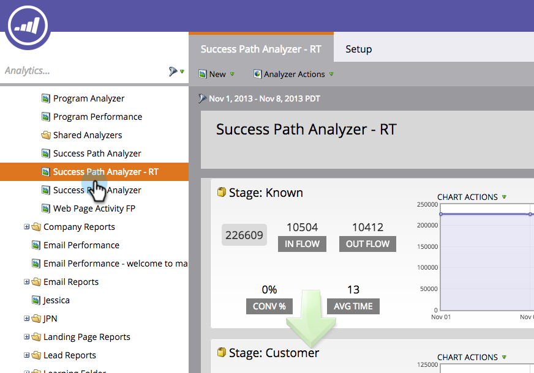
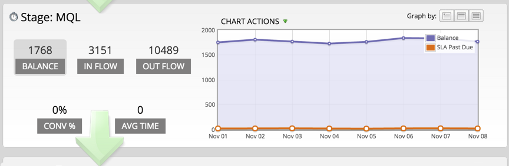

# Utilizzo di Success Path Analyzer {#using-the-success-path-analyzer}

Utilizzare un Analisi del percorso di successo per esplorare i dettagli specifici che riflettono sia il flusso (quantità) che la velocità (velocità, in termini di giorni) delle persone attraverso le fasi del [Modello del ciclo dei ricavi](/help/marketo/product-docs/reporting/revenue-cycle-analytics/revenue-cycle-models/understanding-revenue-models.md).

>[!PREREQUISITES]
>
>[Creare un analizzatore del percorso di successo](/help/marketo/product-docs/reporting/revenue-cycle-analytics/revenue-cycle-models/create-a-success-path-analyzer.md)

1. Vai a **Analytics** e seleziona il tuo **Analisi del percorso di successo**.

   

   Il grafico a destra riflette i dati nel pulsante selezionato a sinistra. Per impostazione predefinita, è Saldo.

1. Clic **In Flusso** per tracciare il numero di persone che sono entrate nell&#39;area di visualizzazione durante l&#39;intervallo di tempo selezionato.

   

   * Fare clic su Flusso in uscita per visualizzare il grafico di quante persone sono uscite dall&#39;area di visualizzazione.
   * Fare clic su Conv % per rappresentare graficamente il tasso di conversione da questa fase alla fase successiva.
   * Fare clic su Tempo medio per vedere quanto tempo le persone trascorrono in questa fase prima di passare alla fase successiva.

1. Clic **Azioni grafico** > Confronta periodo per confrontare i dati con un intervallo di tempo diverso di uguale durata.

   

1. Seleziona la **Da** data del periodo di confronto.

   

   Il **A** La data viene impostata automaticamente in modo da corrispondere alla durata del periodo di tempo originale.

1. Clic **Confronta**.

   

1. Il grafico viene aggiornato in verde con dati sovrapposti per il periodo di confronto.

   

1. Per modificare la scala cronologica del grafico, fare clic su una delle opzioni **Grafico di** pulsanti: giornaliero (impostazione predefinita), settimanale e mensile

   

1. Per le fasi con accordi sui livelli di servizio (SLA), fare clic su **Azioni grafico** > **Mostra scadenza contratto di servizio** per mostrare a ogni persona che non ha raggiunto un obiettivo SLA entro l’intervallo di tempo specificato.

   

1. Il grafico viene aggiornato in arancione in modo da riflettere il numero di SLA dovuti su ciascun nodo.

   

   Le persone visualizzate in arancione potrebbero *o non* essere ancora nella fase SLA.

1. Clic **Azioni grafico** > **Mostra contratto di servizio scaduto** per mostrare tutte le persone con obiettivi SLA scaduti ancora in fase SLA alla fine del periodo di tempo specificato.

   

1. Il grafico viene aggiornato in arancione in modo da riflettere il numero di SLA scaduti su ciascun nodo.

   

1. Per leggere i dettagli specifici di un punto dati su un nodo specifico (data), passa il cursore del mouse sulla bolla.

   

1. Per stampare il grafico, fare clic su **Azioni grafico** > **Stampa grafico**.

   

L&#39;analizzatore è qui per aiutarvi a capire il movimento attraverso il vostro modello. Man mano che progredisci, questo aspetto sarà molto importante per pianificare le tue attività di marketing.
