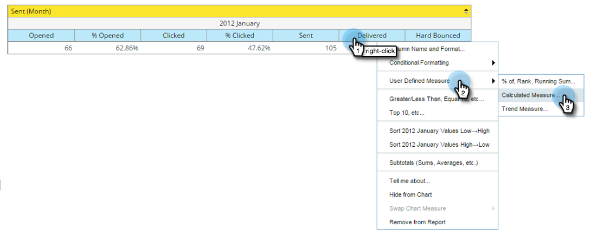
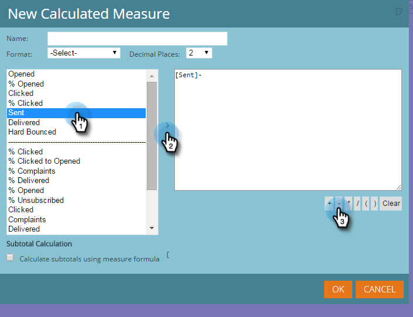

# Aggiunta di misure personalizzate a un rapporto Revenue Explorer {#adding-custom-measures-to-a-revenue-explorer-report}

Talvolta, può essere necessario inserire una misura personalizzata in un rapporto. È facile crearne una tua.

Nell’esempio seguente, stai creando una misura calcolata per mancati recapiti non permanenti, che accetta metriche già presenti nel rapporto e utilizza dati matematici di base per creare una nuova metrica. Potete creare anche altri tipi di misure.

>[!PREREQUISITES]
>
>È necessaria almeno una metrica nel rapporto, ma non deve essere una delle misure utilizzate per definire la misura personalizzata.

1. Recupera i campi necessari per il report. Per ulteriori informazioni, vedere [Aggiunta di campi a un report di Gestione entrate](/help/marketo/product-docs/reporting/revenue-cycle-analytics/revenue-explorer/adding-fields-to-a-revenue-explorer-report.md).

1. Fare clic con il pulsante destro del mouse su una metrica esistente (cella blu), scegliere **[!UICONTROL User Defined Measure]** e selezionare **[!UICONTROL Calculated Measure]**.

   

1. Denomina la misura personalizzata e seleziona un formato.

   

1. Fare clic su ogni elemento desiderato a sinistra e fare clic sulla freccia per spostarlo. Aggiungere simboli matematici in base alle esigenze.

   

   >[!TIP]
   >
   >Potete digitare i simboli matematici personalmente o utilizzare la casella di selezione.

1. Al termine, fare clic su **[!UICONTROL OK]**.

   

   La nuova misura personalizzata viene visualizzata come una nuova colonna nel rapporto.

   

   >[!MORELIKETHIS]
   >
   >[Aggiunta di campi a un report di Revenue Explorer](/help/marketo/product-docs/reporting/revenue-cycle-analytics/revenue-explorer/adding-fields-to-a-revenue-explorer-report.md)
