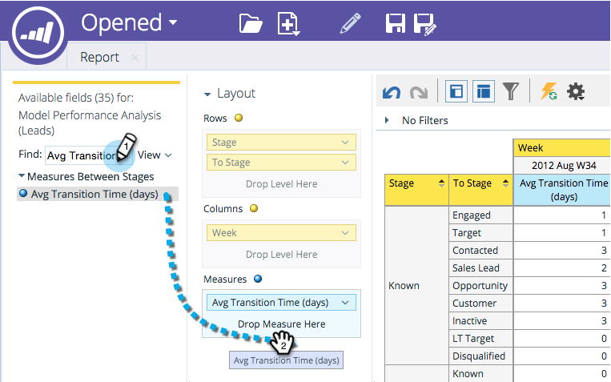

# Aggiunta di campi a un rapporto di Esplora ricavi {#adding-fields-to-a-revenue-explorer-report}

Per personalizzare i rapporti di explorer dei ricavi, trascina e rilascia i campi di dimensione e metriche nell’area di lavoro.

<table> 
 <tbody> 
  <tr> 
   <th>Tipo di campo</th> 
   <th>Descrizione</th> 
  </tr> 
  <tr> 
   <td>Campo o Dimension giallo</td> 
   <td>
I campi gialli sono le dimensioni (righe e colonne) del rapporto.

Ad esempio, puoi impostare un rapporto che mostra lo stato del lead o la data di creazione in colonne.
</td> 
  </tr> 
  <tr> 
   <td>Campo o misura blu</td> 
   <td>
I campi blu sono metriche analizzate nei dati.

Ad esempio, potrebbe trattarsi del punteggio medio per i lead o del numero di giorni in cui un lead ha avuto un’opportunità.
</td> 
  </tr> 
 </tbody> 
</table>

1. Individua i campi gialli che desideri utilizzare e trascinali nelle righe.

   

   >[!TIP]
   >
   >Passa il puntatore del mouse sopra un campo per ottenere una descrizione completa.

1. Individua i campi blu da utilizzare e trascinali in Misure.

   

   Fantastico! Ora avete un rapporto completo!

   

>[!MORELIKETHIS]
>
>[Eliminazione di un campo in un rapporto Revenue Explorer](/help/marketo/product-docs/reporting/revenue-cycle-analytics/revenue-explorer/deleting-a-field-in-a-revenue-explorer-report.md)
