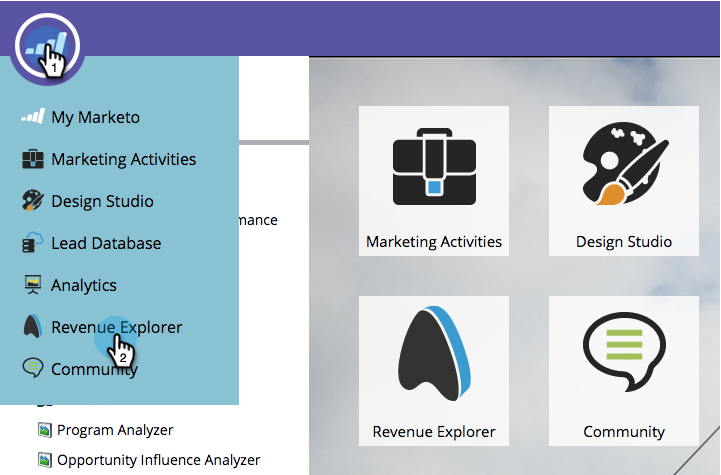
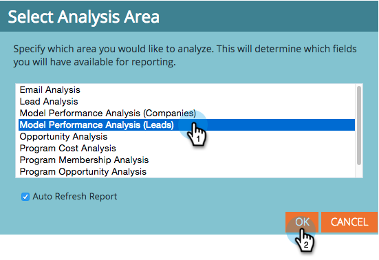

# Creare un rapporto di Esplora ricavi {#create-a-revenue-explorer-report}

Il rapporto Revenue Explorer ti consente di tenere traccia del ROI delle iniziative di marketing.

>[!AVAILABILITY]
>
>Non tutti i clienti hanno acquistato questa funzionalità. Contatta il tuo rappresentante commerciale per i dettagli.

1. Vai a **Esplora ricavi** area.

   

1. Fai clic su **Crea nuovo** quindi seleziona **Rapporto**.

   

1. Scegli un tipo di rapporto.

   

   Fantastico! Hai creato ufficialmente un rapporto. È ora di personalizzare aggiungendo alcuni campi!

   

>[!MORELIKETHIS]
>
>[Aggiunta di campi a un rapporto di Esplora ricavi](/help/marketo/product-docs/reporting/revenue-cycle-analytics/revenue-explorer/adding-fields-to-a-revenue-explorer-report.md)
>[Aggiunta di misure personalizzate a un rapporto di Esplora ricavi](/help/marketo/product-docs/reporting/revenue-cycle-analytics/revenue-explorer/adding-custom-measures-to-a-revenue-explorer-report.md)
