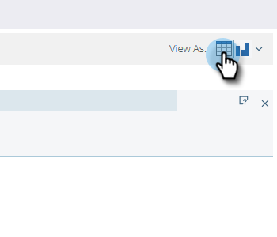

# Grafica Dei Risultati Da Gestione Ricavi {#graphing-results-from-revenue-explorer}

Per impostazione predefinita, i rapporti in Esplora entrate vengono visualizzati sotto forma di tabella. È inoltre possibile visualizzare i risultati sotto forma di grafico in vari formati.

1. Fare clic sulla freccia nella **Visualizza come** menu a discesa del rapporto. Verranno visualizzate diverse opzioni di grafica.

   

## Esempi di grafici {#graph-examples}

**Colonna**: ogni riga e colonna della tabella viene visualizzata come una colonna verticale.

**Colonna in pila**: ogni riga della tabella ha una colonna nel grafico.

**Istogramma in pila 100%**: ogni riga della tabella ha una colonna nel grafico ed è ridimensionata al 100%.

**Linea**: ogni colonna viene visualizzata come una riga e ogni riga come punto dati sulla riga.

**Casella combinata riga colonna**: combinazione di grafici a colonne e a linee.

**Barre**: ogni riga e colonna della tabella viene visualizzata come una barra orizzontale.

**Barre in pila**: ogni riga della tabella ha una riga nel grafico.

**Barre in pila 100%**: ogni riga della tabella ha una riga nel grafico ed è ridimensionata al 100%.

**Superfici**: i dati vengono visualizzati in modo simile alle barre in pila ma vengono compilati.

**Torta**: ogni colonna viene visualizzata come grafico a torta, ogni riga come sezione.

**Sunburst**: grafico radiale che rappresenta gli attributi nelle sezioni.

**A dispersione**: bolle in base agli attributi utilizzati. Utilizza le misure per codificare il colore della bolla e/o determinarne le dimensioni.

**Griglia di calore**: personalizza colori e forme per identificare i pattern di prestazioni positivi e negativi.

1. Per tornare alla vista tabella, fare clic sul pulsante Tabella.

   
