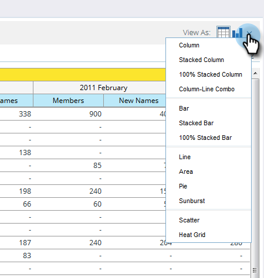

# Grafica Dei Risultati Da [!UICONTROL Revenue Explorer] {#graphing-results-from-revenue-explorer}

Per impostazione predefinita, i report in [!UICONTROL Revenue Explorer] vengono visualizzati come tabella. È inoltre possibile visualizzare i risultati sotto forma di grafico in vari formati.

1. Fare clic sulla freccia nel menu a discesa **[!UICONTROL View As]** del report. Verranno visualizzate diverse opzioni di grafica.

   

## Esempi di grafici {#graph-examples}

**[!UICONTROL Column]**: ogni riga e colonna della tabella viene visualizzata come colonna verticale.

**[!UICONTROL Stacked Column]**: ogni riga della tabella ha una colonna nel grafico.

**[!UICONTROL 100% Stacked Column]**: ogni riga della tabella ha una colonna nel grafico ed è ridimensionata al 100%.

**[!UICONTROL Line]**: ogni colonna viene visualizzata come una riga e ogni riga come punto dati sulla riga.

**[!UICONTROL Column-Line Combo]**: combinazione di [!UICONTROL Column] e [!UICONTROL Line] grafici.

**[!UICONTROL Bar]**: ogni riga e colonna della tabella viene visualizzata come una barra orizzontale.

**[!UICONTROL Stacked Bar]**: ogni riga della tabella ha una riga nel grafico.

**[!UICONTROL 100% Stacked Bar]**: ogni riga della tabella ha una riga nel grafico ed è ridimensionata al 100%.

**[!UICONTROL Area]**: i dati sono visualizzati in modo simile alle barre in pila ma sono stati compilati.

**[!UICONTROL Pie]**: ogni colonna viene visualizzata come grafico a torta, ogni riga come sezione.

**[!UICONTROL Sunburst]**: grafico radiale che rappresenta gli attributi nelle sezioni.

**[!UICONTROL Scatter]**: bolle in base agli attributi utilizzati. Utilizza le misure per codificare il colore della bolla e/o determinarne le dimensioni.

**[!UICONTROL Heat Grid]**: personalizzare colori e forme per identificare i motivi di prestazioni positivi e negativi.

1. Per tornare alla vista tabella, fare clic sul pulsante Tabella.

   
