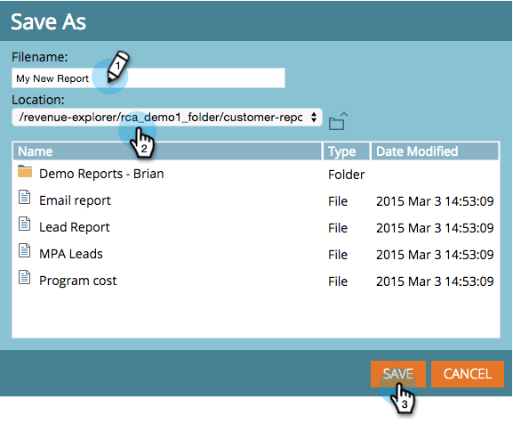

# Salvataggio di un report di Esplora ricavi {#saving-a-revenue-explorer-report}

I rapporti di Esplora entrate possono essere salvati nel file di tua scelta.

1. Fate clic sull&#39;icona Salva.

   

   >[!NOTE]
   >
   >Le modifiche apportate al rapporto non vengono salvate automaticamente. Assicuratevi quindi di risparmiare spesso!

1. Assegna al rapporto un nome descrittivo, seleziona una posizione e fai clic su **Salva**!

   

   È tutto! È ora possibile accedere al file in **Sfoglia file**.

   

>[!MORELIKETHIS]
>
>[Iscriviti a un report di Esplora entrate](/help/marketo/product-docs/reporting/revenue-cycle-analytics/revenue-explorer/subscribe-to-a-revenue-explorer-report.md)
