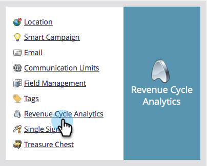

# Sincronizza campi personalizzati in Esplora entrate {#sync-custom-fields-to-the-revenue-explorer}

In Analisi del ciclo delle entrate è possibile generare rapporti sui campi Marketo personalizzati, per fare ciò è necessario impostare i campi personalizzati da sincronizzare.

>[!NOTE]
>
>**Autorizzazioni amministratore richieste**

1. Andate alla sezione **Admin**.

   

1. Selezionare **Analisi del ciclo economico**.

   

1. Fare clic sulla scheda **Sincronizzazione campo personalizzata** e selezionare l&#39;area di analisi desiderata.

   

1. Selezionate il campo per il quale desiderate abilitare la sincronizzazione e fate clic su **Modifica opzione di sincronizzazione**.

   

1. Modificate **Stato sincronizzazione** in **Abilitato**.

   

1. Selezionare il **RCA Type** desiderato, quindi fare clic su **Save**.

   

   >[!TIP]
   >
   >Una volta abilitati, i dati saranno disponibili in Analisi del ciclo economico il giorno successivo.

   Bel lavoro! Ora è possibile aggiungere campi personalizzati a RCA.
