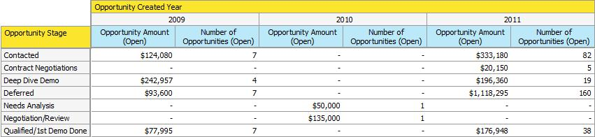

# Analisi delle opportunità in Esplora entrate {#understanding-opportunity-analysis-in-revenue-explorer}

L&#39;analisi delle opportunità in Esplora entrate consente di esaminare le opportunità a un livello più profondo. Consente di suddividere i dati in base a qualsiasi attributo lead/società, ad esempio origine principale, settore o area geografica. Analizzare la creazione di opportunità e chiudere in base al nome, all’area di visualizzazione o alla probabilità. Scopri i contributi di marketing alla pipeline.

## Analisi di esempio {#example-analysis}

Di seguito sono riportati alcuni rapporti che potete creare nell&#39;area Analisi opportunità.

1. Influenza marketing sulle opportunità create

   Quale percentuale della pipeline della tua azienda è stata influenzata dai tuoi programmi di marketing? Questo rapporto vi dà la risposta. I grafici a torta riportati di seguito mostrano la percentuale del numero di tutte le opportunità e l&#39;importo delle opportunità acquisite da un programma di marketing.

   

1. L&#39;influenza del marketing sulle opportunità chiuse e vinte.

   Questo rapporto mostra quante entrate sono state acquisite e influenzate dal marketing, dal numero e dall&#39;importo.

   

1. Opportunità chiusa da origine lead

   Questo rapporto descrive tutte le opportunità chiuse dalla fonte principale e fornisce una chiara panoramica delle fonti che funzionano e che non lo sono.

   

1. Tempo di chiusura per origine

   Questo rapporto illustra il rapporto tra i giorni medi per chiudere un&#39;opportunità e l&#39;origine principale.

   

1. Apertura dell&#39;opportunità e dello stage

   Questo rapporto mostra quante opportunità sono aperte in ogni fase del ciclo di ricavi.

   

1. Numero di opportunità per anno per settore

   Questo rapporto risponde alla domanda: &quot;Stiamo ottenendo più o meno opportunità da certe industrie ogni anno?&quot;

   

## Dimension e misure di analisi delle opportunità {#opportunity-analysis-dimensions-and-measures}

L’analisi delle opportunità consente di accedere a tutte le dimensioni relative a lead, società e opportunità e alle misure relative alle opportunità. Utilizzate queste dimensioni e misure di analisi delle opportunità per rispondere a domande specifiche nel rapporto.

1. Attributi società

   | Dimension | Descrizione |
   |---|---|
   | Entrate annuali | Entrate annuali dell&#39;azienda |
   | Città | La città in cui si trova la società |
   | Paese | La contea in cui si trova la società |
   | Industria | L&#39;industria in cui si trova l&#39;azienda |
   | Nome società | Nome della società |
   | Numero di dipendenti | Numero di dipendenti nella società |
   | Codice postale | Codice postale della società |
   | Codice SIC | Codice SIC della società |
   | Stato | Stato in cui si trova la società |

1. Attributi lead

   | Dimension | Descrizione |
   |---|---|
   |  Inserire nell&#39;elenco Bloccati | Il lead viene  inserire nell&#39;elenco Bloccati |
   | Convertito in opportunità | Il lead viene convertito in un’opportunità |
   | E-mail non valida | Se il lead ha un indirizzo e-mail valido |
   | Marketing sospeso | Il lead è sospeso dalle e-mail di marketing? |
   | Indirizzo e-mail | Indirizzo e-mail del lead |
   | Titolo processo | Titolo processo lead |
   | Nome completo | Nome completo del lead |
   | Tipo origine originale | Tipo di origine originale del lead |
   | Tipo origine registro | Tipo di origine registrato del lead |
   | Indirizzo e-mail proprietario lead | Indirizzo e-mail del proprietario principale |
   | Titolo processo proprietario lead | Titolo del processo del proprietario principale |
   | Nome proprietario lead | Nome del proprietario principale |
   | Origine lead | Origine lead |
   | Stato lead | Stato lead |

1. Fotogramma temporale creato lead

   | Dimension | Descrizione |
   |---|---|
   | Anno di creazione lead | L’anno in cui viene creato il lead |
   | Trimestre lead creato | Trimestre in cui viene creato il lead |
   | Mese di creazione lead | Mese in cui viene creato il lead |
   | Settimana di creazione lead | Settimana in cui viene creato il lead |
   | Data creazione lead | Data di creazione del lead |

1. Attributi opportunità

   | Dimension | Descrizione |
   |---|---|
   | Opportunità chiusa | È chiusa l&#39;opportunità? |
   | Categoria previsione opportunità | Categoria previsione opportunità |
   | Nome opportunità | Nome opportunità |
   | Fase opportunità | Fase di opportunità |
   | Tipo opportunità | Tipo di opportunità |
   | Opportunità raggiunta | Questa opportunità è chiusa e vinta |
   | Opportunità Di Influenza Sul Marketing | Questo flag indica se uno dei lead/contatto è stato acquisito o raggiunto con successo in un programma di marketing. Vengono considerati solo i programmi con un costo di periodo definito. |

1. Scadenza opportunità

   | Dimension | Descrizione |
   |---|---|
   | Anno chiuso opportunità | L&#39;anno in cui l&#39;opportunità viene chiusa |
   | Trimestre chiuso opportunità | Il trimestre in cui l&#39;opportunità è chiusa |
   | Mese chiuso opportunità | Il mese in cui l&#39;opportunità viene chiusa |
   | Settimana chiusa opportunità | Settimana in cui l&#39;opportunità è chiusa |
   | Data di chiusura opportunità | Data in cui l’opportunità viene chiusa |

1. Timeframe creato per l&#39;opportunità

   | Dimension | Descrizione |
   |---|---|
   | Anno creazione opportunità | L&#39;anno in cui viene creata l&#39;opportunità |
   | Trimestre creato per l&#39;opportunità | Il trimestre in cui viene creata l&#39;opportunità |
   | Mese creazione opportunità | Il mese in cui viene creata l&#39;opportunità |
   | Settimana creazione opportunità | Settimana in cui viene creata l&#39;opportunità |
   | Data creazione opportunità | Data di creazione dell&#39;opportunità |

1. Misure

   | Misura | Descrizione |
   |---|---|
   | Giorni medi per chiudere l&#39;opportunità | Numero medio di giorni per chiudere un&#39;opportunità |
   | Giorni medi per chiudere l&#39;opportunità (persa) | Numero medio di giorni per un&#39;opportunità persa |
   | Giorni medi per chiudere l&#39;opportunità (won) | Numero medio di giorni per un&#39;opportunità vincente |
   | Numero di tutte le opportunità | Numero totale di tutte le opportunità |
   | Numero di opportunità (chiuso) | Numero totale di opportunità chiuse (won o perse) |
   | Numero di opportunità (perdute) | Numero totale di opportunità perdute |
   | Numero di opportunità (aperte) | Numero totale di opportunità ancora aperte |
   | Numero di opportunità (won) | Numero totale di opportunità conquistate |
   | Importo opportunità | Importo totale opportunità. Se a un&#39;opportunità è associato più di un lead, l&#39;importo dell&#39;allocazione si basa sul punteggio iniziale. |
   | Importo opportunità (perso) | Importo totale per le opportunità perse. Se a un&#39;opportunità è associato più di un lead, l&#39;importo dell&#39;allocazione si basa sul punteggio iniziale. |
   | Importo opportunità (aperto) | Importo totale per le opportunità aperte. Se a un&#39;opportunità è associato più di un lead, l&#39;importo dell&#39;allocazione si basa sul punteggio iniziale. |
   | Importo opportunità (won) | Importo totale per le opportunità di vincita. Se a un&#39;opportunità è associato più di un lead, l&#39;importo dell&#39;allocazione si basa sul punteggio iniziale. |

>[!MORELIKETHIS]
>
>* [Creazione di un rapporto di Esplora entrate](/help/marketo/product-docs/reporting/revenue-cycle-analytics/revenue-explorer/create-a-revenue-explorer-report.md)
>* [Aggiunta di campi a un rapporto di Esplora entrate](/help/marketo/product-docs/reporting/revenue-cycle-analytics/revenue-explorer/adding-fields-to-a-revenue-explorer-report.md)
>* [Iscriviti a un report di Esplora entrate](/help/marketo/product-docs/reporting/revenue-cycle-analytics/revenue-explorer/subscribe-to-a-revenue-explorer-report.md)

