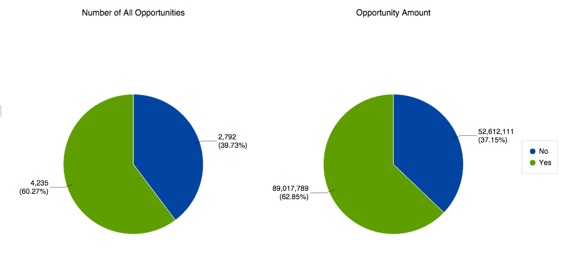

# Analisi delle opportunità in Gestione ricavi {#understanding-opportunity-analysis-in-revenue-explorer}

L’analisi delle opportunità in Esplora ricavi consente di esaminare le opportunità a un livello più approfondito. Puoi suddividere i dati in base agli attributi del lead/azienda, ad esempio origine del lead, settore o area geografica. Analizza la creazione e la chiusura delle opportunità in base al nome, allo stadio o alla probabilità. Scopri i contributi di marketing alla pipeline.

## Esempio di analisi {#example-analysis}

Di seguito sono riportati alcuni rapporti che è possibile creare nell’area Analisi delle opportunità.

1. Influenza del marketing sulle opportunità create

   Quale percentuale della pipeline della tua azienda è stata influenzata dai tuoi programmi di marketing? Questo rapporto vi dà la risposta. I grafici a torta seguenti mostrano la percentuale del numero di tutte le opportunità e la quantità di opportunità acquisite da un programma di marketing.

   

1. Influenza del marketing sulle opportunità chiuse e acquisite.

   Questo rapporto mostra l’importo dei ricavi ottenuti e influenzati dal marketing, per numero e importo.

   

1. Opportunità chiusa dall&#39;origine lead

   Questo rapporto suddivide tutte le opportunità chiuse per origine lead e fornisce una panoramica chiara di quali origini funzionano e quali no.

   

1. Tempo di chiusura per origine

   Questo rapporto illustra la relazione tra la media dei giorni per la chiusura di un&#39;opportunità e l&#39;origine del lead.

   

1. Apri opportunità e staging

   Questo rapporto mostra quante opportunità sono aperte in ogni fase del ciclo dei ricavi.

   

1. Numero di opportunità per anno per settore

   Questo report risponde alla domanda: &quot;Ogni anno, in alcuni settori si ottengono più o meno opportunità?&quot;

   

## Dimension e misure di analisi delle opportunità {#opportunity-analysis-dimensions-and-measures}

L’analisi delle opportunità consente di accedere a tutte le dimensioni relative a lead, società e opportunità e alle misure correlate. Utilizza queste dimensioni e misure di analisi delle opportunità per rispondere a domande specifiche nel rapporto.

1. Attributi società

   | Dimensione | Descrizione |
   |---|---|
   | Entrata annuale | Entrate annuali dell&#39;azienda |
   | Città | La città in cui si trova l’azienda |
   | Paese | La provincia in cui si trova la società |
   | Settore | Settore di attività dell&#39;azienda |
   | Nome azienda | Nome della società |
   | Numero di dipendenti | Numero di dipendenti nella società |
   | Codice postale | Codice postale della società |
   | Codice SIC (Standard Industrial Classification) | Codice SIC della società |
   | Stato | Stato in cui si trova la società |

1. Attributi lead

   | Dimensione | Descrizione |
   |---|---|
   | Inserire nell&#39;elenco Bloccati | Inserire nell&#39;elenco Bloccati Il lead è |
   | Convertito in opportunità | Il lead viene convertito in un’opportunità |
   | E-mail non valida | Se il lead ha un indirizzo e-mail valido |
   | Marketing sospeso | Il lead è sospeso dalle e-mail di marketing |
   | Indirizzo e-mail | Indirizzo e-mail del lead |
   | Qualifica | Qualifica del lead |
   | Nome completo | Nome e cognome del lead |
   | Tipo di sorgente originale | Tipo di origine del lead |
   | Registra tipo di origine | Tipo di origine registrato del lead |
   | Indirizzo e-mail proprietario lead | Indirizzo e-mail del proprietario del lead |
   | Qualifica proprietario lead | Qualifica del proprietario del lead |
   | Nome proprietario lead | Nome del proprietario del lead |
   | Fonte lead | Sorgente lead |
   | Stato lead | Stato lead |

1. Intervallo temporale creato dal lead

   | Dimensione | Descrizione |
   |---|---|
   | Anno di creazione lead | L’anno in cui viene creato il lead |
   | Trimestre lead creato | Trimestre in cui viene creato il lead |
   | Mese creazione lead | Il mese in cui viene creato il lead |
   | Lead creato settimana | La settimana in cui viene creato il lead |
   | Data creazione lead | Data di creazione del lead |

1. Attributi di opportunità

   | Dimensione | Descrizione |
   |---|---|
   | Opportunità chiusa | L’opportunità è chiusa |
   | Categoria previsione opportunità | Categoria previsione opportunità |
   | Nome dell’opportunità | Nome opportunità |
   | Fase dell’opportunità | Fase dell’opportunità |
   | Tipo di opportunità | Tipo di opportunità |
   | Opportunità acquisita | Questa opportunità è chiusa e vinta? |
   | Opportunità Influenzata Dal Marketing | Questo flag indica se uno dei lead/contatti è stato acquisito o ha raggiunto il successo in un programma di marketing. Vengono considerati solo i programmi per i quali è stato definito un costo di periodo. |

1. Intervallo temporale chiuso dell’opportunità

   | Dimensione | Descrizione |
   |---|---|
   | Anno di chiusura dell’opportunità | L’anno in cui l’opportunità viene chiusa |
   | Trimestre chiuso dell’opportunità | Il trimestre in cui l’opportunità viene chiusa |
   | Mese di chiusura dell’opportunità | Il mese in cui l’opportunità viene chiusa |
   | Opportunità - Settimana chiusa | La settimana in cui l’opportunità viene chiusa |
   | Data di chiusura dell’opportunità | Data di chiusura dell&#39;opportunità |

1. Intervallo temporale creato dall’opportunità

   | Dimensione | Descrizione |
   |---|---|
   | Anno creazione opportunità | L’anno in cui viene creata l’opportunità |
   | Trimestre creato dall’opportunità | Il trimestre in cui viene creata l’opportunità |
   | Mese creazione opportunità | Il mese in cui viene creata l’opportunità |
   | Opportunità creata settimana | La settimana in cui viene creata l’opportunità |
   | Data di creazione dell’opportunità | Data di creazione dell’opportunità |

1. Misure

   | Misura | Descrizione |
   |---|---|
   | Media giorni per chiusura opportunità | Numero medio di giorni per la chiusura di un&#39;opportunità |
   | Media giorni per chiusura opportunità (perduta) | Numero medio di giorni per un&#39;opportunità persa |
   | Media giorni per chiusura opportunità (ottenuti) | Numero medio di giorni per un&#39;opportunità acquisita |
   | Numero di opportunità | Numero totale di tutte le opportunità |
   | Numero di opportunità (chiuse) | Numero totale di opportunità chiuse (realizzate o perse) |
   | Numero di opportunità (perse) | Numero totale di opportunità perse |
   | Numero di opportunità (aperte) | Numero totale di opportunità ancora aperte |
   | Numero di opportunità (realizzate) | Numero totale di opportunità realizzate |
   | Importo dell’opportunità | Importo totale dell’opportunità. Se a un&#39;opportunità sono associati più lead, l&#39;importo dell&#39;allocazione si basa sul punteggio del lead. |
   | Importo dell’opportunità (perso) | Importo totale per le opportunità perse. Se a un&#39;opportunità sono associati più lead, l&#39;importo dell&#39;allocazione si basa sul punteggio del lead. |
   | Importo dell’opportunità (aperto) | Importo totale per le opportunità aperte. Se a un&#39;opportunità sono associati più lead, l&#39;importo dell&#39;allocazione si basa sul punteggio del lead. |
   | Importo dell’opportunità (Won) | Importo totale per le opportunità realizzate. Se a un&#39;opportunità sono associati più lead, l&#39;importo dell&#39;allocazione si basa sul punteggio del lead. |

>[!MORELIKETHIS]
>
>* [Creare un rapporto di Gestione ricavi](/help/marketo/product-docs/reporting/revenue-cycle-analytics/revenue-explorer/create-a-revenue-explorer-report.md)
>* [Aggiunta di campi a un rapporto di Gestione entrate](/help/marketo/product-docs/reporting/revenue-cycle-analytics/revenue-explorer/adding-fields-to-a-revenue-explorer-report.md)
>* [Iscriviti a un rapporto di Revenue Explorer](/help/marketo/product-docs/reporting/revenue-cycle-analytics/revenue-explorer/subscribe-to-a-revenue-explorer-report.md)
