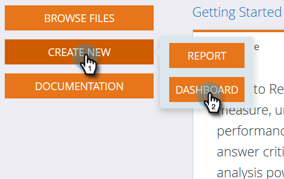

# Utilizzo dei dashboard in Revenue Explorer {#using-dashboards-in-revenue-explorer}

Una dashboard è una combinazione di rapporti di Revenue Explorer che consentono di ottenere una rapida panoramica di lead, campagne, opportunità e/o modelli.

## Creazione di un nuovo dashboard {#creating-a-new-dashboard}

1. Clic **Gestione ricavi**.

   

1. Clic **Crea nuovo**, quindi **Dashboard**.

   

1. Nella parte inferiore della pagina, i modelli saranno selezionati per impostazione predefinita. Fare clic sul layout che si desidera utilizzare. &quot;2 Column&quot; viene utilizzato qui.

   

   >[!NOTE]
   >
   >È possibile personalizzare ulteriormente l&#39;aspetto del dashboard facendo clic su **Temi** e scegliendo il tuo preferito.

1. Nella prima sezione del dashboard, fai clic su **Inserisci** e seleziona **File**.

   

1. Doppio clic **Gestione ricavi**.

   

1. Doppio clic **Tutti i report e le dashboard**.

   

1. Fare doppio clic sulla cartella contenente il report che si desidera utilizzare.

   

1. Scegli il rapporto e fai clic su **Seleziona**.

   

1. Il report verrà quindi popolato. Ripetere i passaggi 4-8 per ogni sezione rimanente.

   

1. Per rinominare una sezione, fai clic su di essa per selezionarla, digita il nome desiderato in Titolo e fai clic su **Applica**. Ripeti per ogni sezione.

   

1. Per salvare, fai clic sull’icona Salva, immetti un nome file, fai doppio clic sulla cartella di Revenue Explorer fino a raggiungere la cartella desiderata per il dashboard e fai clic su **Salva**.

   

## Modifica di un dashboard {#editing-a-dashboard}

1. Clic **Gestione ricavi**.

   

1. Fai doppio clic su **Gestione ricavi** cartella. Passa alla posizione in cui si trova il dashboard.

   

1. Seleziona la dashboard da modificare, quindi fai clic su **Modifica**.

   

## Eliminazione di un dashboard {#deleting-a-dashboard}

1. Clic **Gestione ricavi**.

   

1. Fai doppio clic su **Gestione ricavi** cartella. Passa alla posizione in cui si trova il dashboard.

   

1. Seleziona la dashboard da eliminare, quindi fai clic su **Sposta nel cestino**.

   
