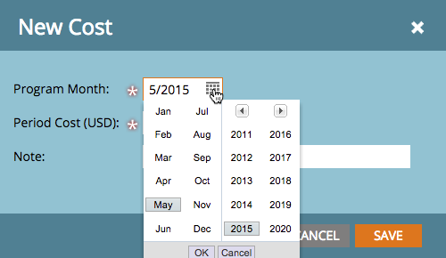

# Definire i costi del periodo {#define-period-costs}

>[!NOTE]
>
>**Definizione**
>
>Il costo di un periodo è l&#39;importo speso per un programma. Può essere per uno o più mesi e viene utilizzato per la generazione di rapporti sul ROI.

Tieni traccia e associa i costi di sviluppo dei lead e di acquisizione dei lead per un programma o un evento definendo quando e dove desideri sostenere i costi per i lead.

>[!NOTE]
>
>All&#39;inizio di un programma, inserire i costi previsti. Una volta completato il periodo nel programma, è possibile modificare il costo del periodo e inserire il costo effettivo. Questo ti fornirà risultati di reporting accurati.

## Definire un costo del periodo {#define-a-period-cost}

1. Accedere al **Configurazione** della scheda Programma o Evento.

   

1. Trascinamento della selezione **Costo del periodo** all&#39;area di lavoro e al **Nuovo costo** viene visualizzata la finestra di dialogo.

   

1. Inserisci il **Mese del programma** da associare al costo definito.

   

1. Inserisci un **Costo del periodo** come numero intero senza decimali o virgole (limite massimo: (99999999)

   

   >[!NOTE]
   >
   >Valuta (ad esempio USD, EUR, ecc.) è un’impostazione globale gestita da un amministratore Marketo

1. Immetti un descrittivo **Nota** (facoltativo) e fai clic su **Salva**.

   

## Modificare un costo del periodo {#edit-a-period-cost}

1. Fare clic con il pulsante destro del mouse sul costo del periodo e selezionare **Modifica** dal menu a comparsa per aprire **Modifica costo** finestra di dialogo.

   

1. Modifica il costo del periodo in base alle esigenze

   

## Elimina un costo del periodo {#delete-a-period-cost}

1. Fare clic con il pulsante destro del mouse sul costo del periodo che si desidera eliminare e selezionare **Elimina** dal menu a comparsa per visualizzare il **Elimina costo** richiesta.

   

1. Fai clic su **Elimina** per eliminare definitivamente il costo del periodo, oppure **Annulla** per tornare indietro.

   
