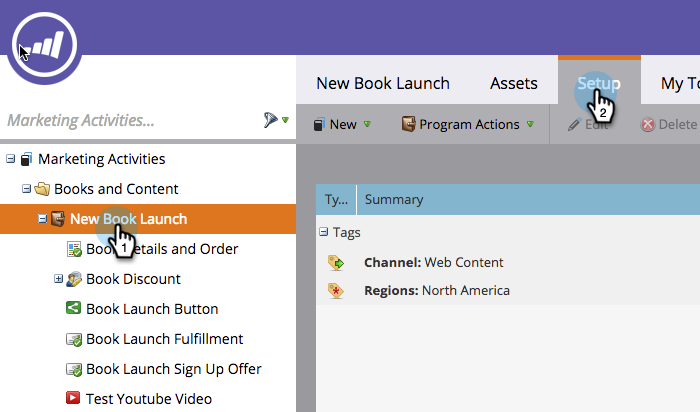

# Definisci costi periodo {#define-period-costs}

>[!NOTE]
>
>**Definizione**
>
>Un costo periodo è l&#39;importo speso per un programma. Può essere per uno o più mesi ed è utilizzato per la generazione di rapporti sul ROI.

Tenere traccia e associare i costi di sviluppo dei lead e di acquisizione dei lead per un programma o un evento definendo quando e dove si desidera sostenere i costi per i lead.

>[!NOTE]
>
>All&#39;inizio di un programma, inserire i costi previsti. Al termine del periodo nel programma, è possibile modificare il Costo periodo e inserire il costo effettivo. Questo ti fornirà risultati di reporting precisi.

## Definisci un costo periodo {#define-a-period-cost}

1. Accedere a **Configurazione** del programma o dell’evento.

   

1. Trascina **Costo periodo** all’area di lavoro e al **Nuovo costo** viene visualizzata.

   

1. Inserisci il **Mese programma** si desidera associarlo al costo definito.

   

1. Immetti un **Costo periodo** numero intero senza decimali o virgole (limite massimo: 99999999)

   

   >[!NOTE]
   >
   >La valuta (ad esempio USD, EUR, ecc.) è un’impostazione globale gestita da un amministratore di Marketo

1. Inserisci un valore descrittivo **Nota** (facoltativo) e fai clic su **Salva**.

   

## Modifica costo periodo {#edit-a-period-cost}

1. Fare clic con il pulsante destro del mouse sul Costo periodo e selezionare **Modifica** dal menu a comparsa per aprire **Modifica costo** .

   

1. Modifica il costo del periodo in base alle esigenze

   

## Eliminare un costo periodo {#delete-a-period-cost}

1. Fare clic con il pulsante destro del mouse sul Costo periodo che si desidera eliminare e selezionare **Elimina** dal menu a comparsa per visualizzare **Elimina costo** prompt.

   

1. Clic **Elimina** per eliminare definitivamente il Costo periodo, oppure **Annulla** per tornare indietro.

   
