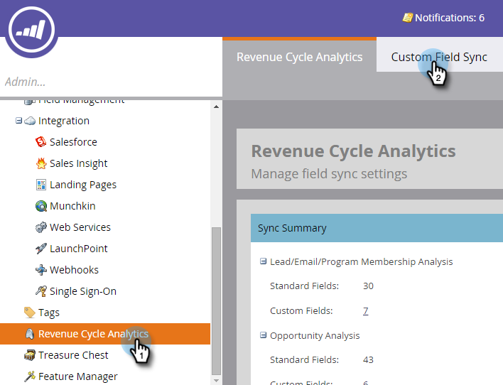

# Abilitazione della sincronizzazione dei campi personalizzati per Revenue Cycle Analytics {#enabling-custom-field-sync-for-revenue-cycle-analytics}

I passaggi seguenti ti consentono di utilizzare campi personalizzati nei rapporti RCA.

1. Clic **Amministratore**.

   

1. Clic **Analisi del ciclo dei ricavi**, quindi **Sincronizzazione campi personalizzati**.

   

1. Seleziona il **Nome campo**, quindi fai clic su **Modifica opzione di sincronizzazione**.

   

1. In Stato sincronizzazione, seleziona **Abilitato**, quindi fai clic su **Salva**.

   

1. La spunta verde indica che il campo è impostato per la sincronizzazione.

   

   E questo è quanto!

   >[!NOTE]
   >
   >Dopo l’abilitazione del campo, i dati saranno disponibili in Revenue Cycle Analytics il giorno successivo.
