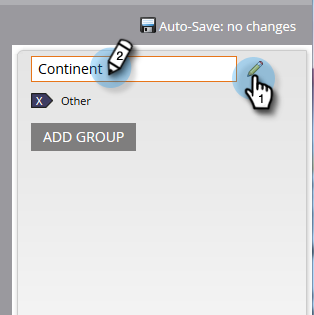

# Creazione di gruppi di campi personalizzati con l&#39;organizzatore dei campi {#create-custom-field-groups-using-the-field-organizer}

Prima di poter abilitare i gruppi di campi personalizzati per la creazione di rapporti nell&#39;area Analisi prestazioni modello (Lead) di Esplora ciclo ricavi, è necessario classificare i campi standard o personalizzati in gruppi per la creazione di rapporti tramite l&#39;organizzatore di campi in Gestione lead Marketo. Questo vale solo per gli attributi lead e della società.
Quando si seleziona un campo standard o personalizzato dall’elenco a discesa Campo nella finestra di dialogo Nuovo organizzatore di campi, il sistema mappa il tipo di dati Gestione lead marketing associato al campo che si desidera raggruppare con uno dei tre editor disponibili in Organizer campi: stringa, numero intero o data.

| Tipo di dati di gestione del lead marketing | Tipo di dati Editor di Field Organizer |
|---|---|
| Stringa | Stringa |
| E-mail | Stringa |
| Integer | Integer |
| Testo | Stringa |
| URL | Stringa |
| Riferimento | Non supportato |
| Valuta | Integer |
| DateTime | Data |
| Booleano | Non supportato |
| Telefono | Stringa |
| Data | Data |
| Mobile | Integer |
| Calcolato | Non supportato |

Nelle tre sezioni seguenti viene descritto come creare un gruppo di campi personalizzato per una stringa, un numero intero o un tipo di data.

## Crea gruppo di campi personalizzato - Editor di stringhe {#create-custom-field-group-string-editor}

1. Fare clic su **Database lead**.

   

1. Fare clic su **Nuovo**, quindi selezionare **Nuovo organizzatore di campi**.

   

1. Fare clic su **Field** e selezionare un campo standard o personalizzato con un tipo di dati associato all&#39;editor di stringhe (vedere la tabella nella sezione precedente). Il paese è usato qui.

   

1. Fare clic su **Crea**.

   

   Il nuovo gruppo personalizzato viene visualizzato nella struttura del database lead rappresentata come Nome campo > Gruppo di nomi campo (ad esempio: Paese > Paese).

   

1. Fate clic sull’icona matita per personalizzare il nome. Ad esempio, è possibile rinominare &quot;Country Group&quot; in &quot;Continent&quot;. Digitate il nuovo nome desiderato e fate clic lontano dalla casella per salvare automaticamente.

   

1. Per impostazione predefinita, tutti i valori dei dati sono inseriti nel sottogruppo &quot;Altro&quot;. Per classificare i valori dei dati, fare clic su **Aggiungi gruppo** per creare un sottogruppo e assegnare un nome.

   >[!NOTE]
   >
   >È possibile aggiungere fino a dieci sottogruppi per classificare i valori dei dati. A ciascun sottogruppo creato viene assegnato un numero ID.

   In questo esempio, sono stati creati gruppi per la maggior parte dei continenti.

   

   >[!NOTE]
   >
   >Per eliminare un sottogruppo, fate clic sulla X rossa accanto al nome del sottogruppo. Se nel gruppo sono presenti valori di dati, i valori dei dati saranno spostati nel gruppo predefinito Altro.

1. Evidenzia uno o più valori di dati nel quadro e trascina e rilascia i valori di dati nel sottogruppo appropriato.

   

   >[!NOTE]
   >
   >Per rimuovere un valore di dati da un sottogruppo, riassegna il valore di dati al gruppo predefinito Altro.

1. Utilizzate l&#39;opzione filtro nell&#39;angolo superiore sinistro direttamente sopra il quadro per selezionare e visualizzare i valori dei dati in uno o più sottogruppi. I valori dei dati basati sulla selezione del filtro vengono visualizzati nel quadro.

   

   >[!NOTE]
   >
   >Una volta definiti i gruppi, è possibile abilitare il gruppo di campi personalizzato per il reporting in Analisi prestazioni modello (Lead) tramite la scheda Analisi ciclo ricavi in Gestione lead Marketo.

## Crea gruppo di campi personalizzato - Editor intero {#create-custom-field-group-integer-editor}

1. Fare clic su **Database lead**.

   

1. Fare clic su **Nuovo**, quindi selezionare **Nuovo organizzatore di campi**.

   

1. Fare clic su **Field** e selezionare un campo standard o personalizzato con un tipo di dati associato all&#39;editor di stringhe (vedere la tabella nella sezione precedente). Le entrate annuali sono utilizzate qui.

   

1. Fare clic su **Crea**.

   

   Il nuovo gruppo personalizzato viene visualizzato nella struttura del database lead rappresentata come Nome campo > Gruppo di nomi campo (ad esempio: Entrate annue > Gruppo di ricavi annuali).

   

1. Fate clic sul nome del gruppo personalizzato predefinito sopra l’editor di numeri interi per personalizzare il nome. Ad esempio, è possibile rinominare il gruppo di ricavi annuali in &quot;Ricavi annuali per dimensione&quot;. Fare clic su **Salva**.

   

   L’editor di numeri interi consente di creare più sottogruppi per definire ciascun sottogruppo per dimensione. In questo esempio, verranno creati tre gruppi per le aziende piccole, medie e Enterprise.

1. Per aggiungere il primo gruppo, immettete un nome nel campo **Nome gruppo** (ad esempio: Piccolo) e immettete un valore massimo nel campo **Intervallo gruppi** (esempio: 200000). Fare clic su **Aggiungi gruppo**.

   

   Sotto il gruppo appena immesso viene visualizzata una voce di gruppo vuota. L’esempio seguente mostra una voce per le aziende piccole, medie e Enterprise.

   >[!NOTE]
   >
   >È possibile aggiungere fino a dieci sottogruppi per classificare i valori dei dati. Ogni voce Intervallo gruppo si basa sulla voce precedente. Se lasciate vuota l’ultima voce Intervallo gruppo per l’ultimo sottogruppo personalizzato creato, non viene impostato un valore massimo di dati.

1. Fate clic sulla scheda Riepilogo per salvare e rivedere le impostazioni.

   

   >[!NOTE]
   >
   >Per eliminare un sottogruppo, fate clic sulla X rossa accanto al nome del sottogruppo.

1. Nella pagina Riepilogo, controlla le impostazioni.

   

   >[!NOTE]
   >
   >Una volta definiti i gruppi, è possibile abilitare il gruppo di campi personalizzato per il reporting in Analisi prestazioni modello (Lead) tramite la scheda Analisi ciclo ricavi in Gestione lead Marketo.

## Crea gruppo di campi personalizzato - Editor di date {#create-custom-field-group-date-editor}

1. Fare clic su **Database lead**.

   

1. Fare clic su **Nuovo**, quindi selezionare **Nuovo organizzatore di campi**.

   

1. Fare clic su **Field** e selezionare un campo standard o personalizzato con un tipo di dati associato all&#39;editor di stringhe (vedere la tabella nella sezione precedente). Data acquisizione è utilizzata qui.

   

1. Fare clic su **Crea**.

   

   Il nuovo gruppo personalizzato viene visualizzato nella struttura del database lead rappresentata come Nome campo > Gruppo di nomi campo (ad esempio: Data acquisizione > Gruppo di date acquisizione).

   

1. Fate clic sul nome del gruppo personalizzato predefinito sopra l’editor date per personalizzare il nome. Ad esempio, puoi rinominare &quot;Acquisition Date Group&quot; in &quot;Acquisition Date Categories&quot;. Fare clic su **Salva**.

   

   L’editor date consente di creare più sottogruppi e di definire ciascun sottogruppo per data. In questo esempio, verranno creati tre gruppi: Q1-15 Lead, Q2-15 Lead e Q3-15 Lead.

1. Per aggiungere il primo gruppo, immettete un nome nel campo **Nome gruppo** (ad esempio: Q1-15 Lead) e immettete una data nel campo della data che rappresenti la data in cui il lead è stato acquisito o precedente (ad esempio: 3/31/2015 per l&#39;ultimo giorno del primo trimestre (15). Fare clic su **Aggiungi gruppo**.

   

   >[!NOTE]
   >
   >È possibile aggiungere fino a dieci sottogruppi per classificare i valori dei dati. Ogni voce Intervallo gruppo si basa sulla voce precedente. Se lasciate vuota l’ultima voce Intervallo gruppo per l’ultimo sottogruppo personalizzato creato, non viene impostato un valore di data di fine.

   L&#39;esempio seguente mostra una voce relativa al primo trimestre del 2015 che attraversa il terzo trimestre.

   

   Ed è tutto! Ottimo lavoro.
