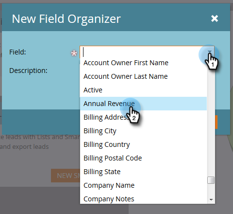

# Creare gruppi di campi personalizzati utilizzando l’Organizzatore di campi {#create-custom-field-groups-using-the-field-organizer}

Prima di poter abilitare i gruppi di campi personalizzati per i rapporti nell&#39;area Analisi delle prestazioni del modello (Lead) di Esplora ciclo dei ricavi, è necessario classificare i campi standard o personalizzati in gruppi per i rapporti tramite l&#39;Organizzatore di campi in Gestione lead Marketo. Questo vale solo per gli attributi lead e aziendali.
Quando si seleziona un campo standard o personalizzato dall’elenco a discesa Campo nella finestra di dialogo Nuovo organizzatore di campi, il sistema mappa il tipo di dati Gestione lead Marketo associato al campo che si desidera raggruppare con uno dei tre editor disponibili nell’Organizer campi: stringa, numero intero o data.

| Tipo di dati di gestione dei lead Marketo | Tipo di dati dell’editor di Organizer campi |
|---|---|
| Stringa | Stringa |
| E-mail | Stringa |
| Intero | Intero |
| Testo | Stringa |
| URL | Stringa |
| Riferimento | Non supportato |
| Valuta | Intero |
| Data e ora | Data |
| Booleano | Non supportato |
| Telefono | Stringa |
| Data | Data |
| Mobile | Intero |
| Calcolato | Non supportato |

Nelle tre sezioni successive viene descritto come creare un gruppo di campi personalizzato per una stringa, un numero intero o un tipo di data.

## Crea gruppo di campi personalizzato - Editor di stringhe {#create-custom-field-group-string-editor}

1. Fai clic su **Database lead**.

   

1. Fai clic su **Nuovo**, quindi seleziona **Nuovo Organizzatore di campi**.

   

1. Fai clic su **Campo** e seleziona un campo standard o personalizzato con un tipo di dati associato all’editor di stringhe (vedi tabella nella sezione precedente). Il paese viene utilizzato qui.

   

1. Fai clic su **Crea**.

   

   Il nuovo gruppo personalizzato viene visualizzato nella struttura del database lead rappresentata come Nome campo > Gruppo di nomi campo (esempio: Paese > Paese).

   

1. Fai clic sull’icona a forma di matita per personalizzare il nome. Ad esempio, è possibile rinominare &quot;Gruppo di paesi&quot; in &quot;Continente&quot;. Digita il nuovo nome desiderato e fai clic lontano dalla casella per il salvataggio automatico.

   

1. Per impostazione predefinita, tutti i valori dei dati sono inseriti nel sottogruppo &quot;Altro&quot;. Per classificare i valori dei dati, fai clic su **Aggiungi gruppo** per creare un sottogruppo e assegnargli un nome.

   >[!NOTE]
   >
   >Puoi aggiungere fino a dieci sottogruppi per classificare i valori dei dati. A ciascun sottogruppo creato viene assegnato un numero ID.

   In questo esempio sono stati creati gruppi per la maggior parte dei continenti.

   

   >[!NOTE]
   >
   >Per eliminare un sottogruppo, fai clic sulla X rossa accanto al nome del sottogruppo. Se nel gruppo sono presenti valori di dati, questi verranno spostati nel gruppo predefinito Altro.

1. Evidenzia uno o più valori di dati nell’area di lavoro e trascina e rilascia i valori di dati nel sottogruppo appropriato.

   

   >[!NOTE]
   >
   >Per rimuovere un valore di dati da un sottogruppo, riassegnare il valore di dati al gruppo predefinito Altro.

1. Utilizza l’opzione filtro nell’angolo in alto a sinistra direttamente sopra l’area di lavoro per selezionare e visualizzare i valori dei dati in uno o più sottogruppi. I valori dei dati basati sulla selezione del filtro vengono visualizzati nell’area di lavoro.

   

   >[!NOTE]
   >
   >Una volta definiti i gruppi, puoi abilitare il gruppo di campi personalizzati per il reporting in Analisi delle prestazioni del modello (Lead) tramite la scheda Analisi del ciclo di ricavi in Gestione lead Marketo.

## Crea gruppo di campi personalizzato - Editor intero {#create-custom-field-group-integer-editor}

1. Fai clic su **Database lead**.

   

1. Fai clic su **Nuovo**, quindi seleziona **Nuovo Organizzatore di campi**.

   

1. Fai clic su **Campo** e seleziona un campo standard o personalizzato con un tipo di dati associato all’editor di stringhe (vedi tabella nella sezione precedente). Le entrate annuali sono utilizzate qui.

   

1. Fai clic su **Crea**.

   

   Il nuovo gruppo personalizzato viene visualizzato nella struttura del database lead rappresentata come Nome campo > Gruppo di nomi campo (esempio: Entrate annuali > Gruppo di entrate annuali).

   

1. Fai clic sul nome del gruppo personalizzato predefinito sopra l’editor di numeri interi per personalizzare il nome. Ad esempio, puoi rinominare &quot;Gruppo di ricavi annuali&quot; in &quot;Ricavo annuale per dimensione&quot;. Fai clic su **Salva**.

   

   L’editor di numeri interi consente di creare più sottogruppi per definire ogni sottogruppo in base alle dimensioni. In questo esempio verranno creati tre gruppi per le aziende di piccole, medie e imprese.

1. Per aggiungere il primo gruppo, immetti un nome nel **Nome gruppo** campo (esempio: Piccolo) e inserisci un valore massimo nel campo **Intervallo di gruppi** campo (esempio: 200000). Fai clic su **Aggiungi gruppo**.

   

   Sotto il gruppo appena inserito viene visualizzata una voce di gruppo vuota. L’esempio seguente mostra una voce per le aziende piccole, medie e Enterprise.

   >[!NOTE]
   >
   >Puoi aggiungere fino a dieci sottogruppi per classificare i valori dei dati. Ogni voce di Intervallo di gruppi si basa sulla voce precedente. Se si lascia vuota l’ultima voce di Intervallo di gruppi per l’ultimo sottogruppo personalizzato creato, non viene impostato un valore di dati massimo.

1. Fai clic sulla scheda Riepilogo per salvare e rivedere le impostazioni.

   

   >[!NOTE]
   >
   >Per eliminare un sottogruppo, fare clic sulla X rossa accanto al nome del sottogruppo.

1. Nella pagina Riepilogo , controlla le impostazioni.

   

   >[!NOTE]
   >
   >Una volta definiti i gruppi, puoi abilitare il gruppo di campi personalizzati per il reporting in Analisi delle prestazioni del modello (Lead) tramite la scheda Analisi del ciclo di ricavi in Gestione lead Marketo.

## Crea gruppo di campi personalizzati - Editor di date {#create-custom-field-group-date-editor}

1. Fai clic su **Database lead**.

   

1. Fai clic su **Nuovo**, quindi seleziona **Nuovo Organizzatore di campi**.

   

1. Fai clic su **Campo** e seleziona un campo standard o personalizzato con un tipo di dati associato all’editor di stringhe (vedi tabella nella sezione precedente). La data di acquisizione viene utilizzata qui.

   

1. Fai clic su **Crea**.

   

   Il nuovo gruppo personalizzato viene visualizzato nella struttura del database lead rappresentata come Nome campo > Gruppo di nomi campo (esempio: Data di acquisizione > Gruppo di date di acquisizione).

   

1. Fai clic sul nome del gruppo personalizzato predefinito sopra l’editor di date per personalizzare il nome. Ad esempio, puoi rinominare &quot;Gruppo di date di acquisizione&quot; in &quot;Categorie di date di acquisizione&quot;. Fai clic su **Salva**.

   

   L’editor date consente di creare più sottogruppi e di definire ciascun sottogruppo per data. In questo esempio verranno creati tre gruppi: Lead Q1-15, lead Q2-15 e lead Q3-15.

1. Per aggiungere il primo gruppo, immetti un nome nel **Nome gruppo** campo (esempio: Q1-15 Lead) e immetti nel campo data una data che rappresenta la data in cui il lead è stato acquisito o precedente (ad esempio: 31/03/2015 per l&#39;ultimo giorno di Q1-15). Fai clic su **Aggiungi gruppo**.

   

   >[!NOTE]
   >
   >Puoi aggiungere fino a dieci sottogruppi per classificare i valori dei dati. Ogni voce di Intervallo di gruppi si basa sulla voce precedente. Se si lascia vuota l’ultima voce di Intervallo di gruppi per l’ultimo sottogruppo personalizzato creato, non viene impostato un valore di data di fine.

   L&#39;esempio seguente mostra una voce per il primo trimestre del 2015 che passa attraverso il terzo trimestre.

   

   Ed è tutto! Ottimo lavoro.
