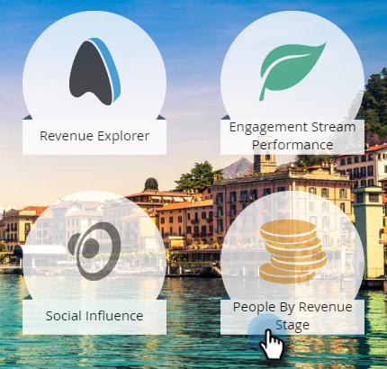
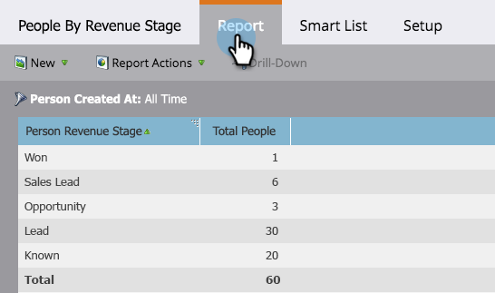

# Rapporto persone per fase dei ricavi {#people-by-revenue-stage-report}

Puoi creare un rapporto che mostra in quale fase del modello del ciclo dei ricavi si trovano le persone. Il rapporto include qualsiasi fase del modello specificato, purché esista un saldo persona per l’intervallo di date specificato del rapporto.

>[!AVAILABILITY]
>
>Non tutte le edizioni di Marketo includono questa funzionalità. Per maggiori informazioni, contatta il tuo Account Manager.

1. Passa a **[!UICONTROL Analytics]**.

   

1. Fare clic sul report per **[!UICONTROL People by Revenue Stage]**.

   

1. Fai clic sulla scheda **[!UICONTROL Setup]**. Fare doppio clic sul campo **[!UICONTROL Person Created At]** per impostare l&#39;intervallo di tempo desiderato per il report.

   

1. Modificare l&#39;intervallo di tempo e fare clic su **[!UICONTROL Save]**.

   

1. Fai clic sulla scheda **[!UICONTROL Report]**. Ora puoi vedere in quale fase del tuo modello di fatturato si trovano le persone e concentrarti su eventuali colli di bottiglia.

   
