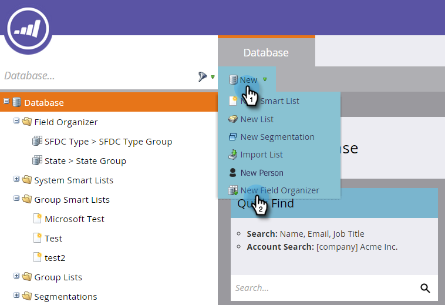

# Utilizzo di Organizer campi {#using-field-organizers}

Gli organizzatori di campi consentono di specificare determinati campi tra tutti i valori possibili. Ad esempio, è possibile creare raggruppamenti significativi, ad esempio West Coast e East Coast, per il campo Territorio. In questo modo i rapporti possono essere eseguiti più rapidamente.

Gli organizzatori dei campi sono simili alle segmentazioni, che vengono utilizzate genericamente, ma gli organizzatori dei campi vengono utilizzati per la generazione di rapporti a livello di campo.

In un elenco di campi puoi avere fino a tre segmentazioni personalizzate.

Non esiste un rapporto specifico Organizzatori di campi.

Gli organizzatori di campi vengono utilizzati nell&#39;analisi delle prestazioni del modello.

## Come creare organizzatori di campi {#how-to-create-field-organizers}

1. Clic **Database**.

   

1. Sotto **Nuovo**, seleziona **Crea Organizzatore Campi**.

   

1. Sotto **Campo**, selezionare un attributo. Descrizione facoltativa.

   

1. Fai clic su **Crea**.

   

1. Assegna un nome al gruppo e immetti i dati appropriati (che dipendono dal tipo di dati del campo selezionato). Clic **Aggiungi gruppo**.

   

Creare più organizzatori di campi allo stesso modo, se necessario. Ed eccoti qui.

>[!MORELIKETHIS]
>
>[Creare gruppi di campi personalizzati utilizzando l’Organizer campi](/help/marketo/product-docs/reporting/revenue-cycle-analytics/revenue-tools/field-organizers/create-custom-field-groups-using-the-field-organizer.md)
