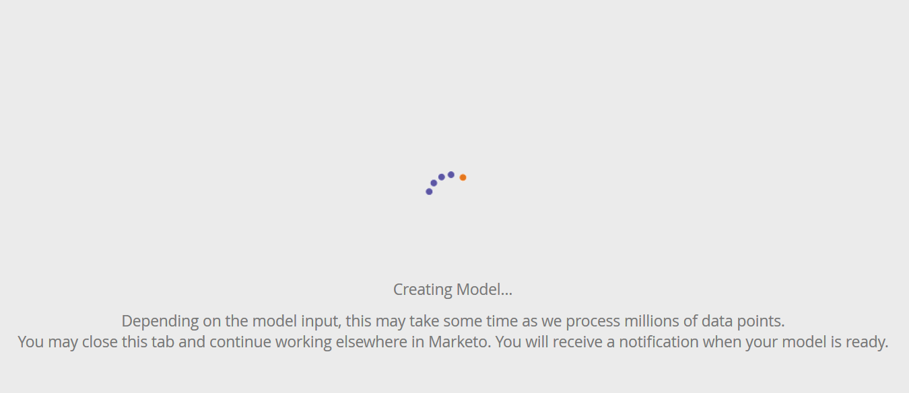

# Configurazione della profilazione dell&#39;account {#setting-up-account-profiling}

Per iniziare a utilizzare la profilazione account, segui la procedura riportata di seguito.

>[!IMPORTANT]
>
>A partire dal 2025, la profilazione degli account non è più disponibile per i nuovi utenti. Continuerà a funzionare per gli utenti esistenti.

>[!CAUTION]
>
>I campi seguenti devono essere **not** nascosti per il corretto funzionamento del profiling account.
>
>* Sito web
>* Azienda
>* E-mail
>* Paese
>
>Scopri come [scoprire un campo qui](/help/marketo/product-docs/administration/field-management/hide-and-unhide-a-field.md#unhide-a-field).

1. In Il mio Marketo, apri **[!UICONTROL Target Account Management]**.

   

1. Fai clic sulla scheda **[!UICONTROL Account Profiling]**.

   

1. Per impostazione predefinita, viene aperta la scheda Modello (Model). Fai clic su **[!UICONTROL Get Started]**.

   

1. Assegna un nome al modello e scegli il tipo di elenco o l’elenco di persone che fungeranno da base per il profilo cliente ideale (ICP). Al termine, fai clic su **[!UICONTROL Create Model]**.

   

1. Il modello inizierà la sua generazione. Potrebbe volerci un po&#39; di tempo, ma non preoccuparti, riceverai una notifica al termine dell&#39;operazione.

   

1. Per visualizzare i risultati del modello, fare clic su **[!UICONTROL See Model Result]**.

   

   Il modello è stato creato.

   

   >[!TIP]
   >
   >Dopo aver creato il modello, [scopri come ottimizzarlo](/help/marketo/product-docs/target-account-management/account-profiling/account-profiling-ranking-and-tuning.md).
