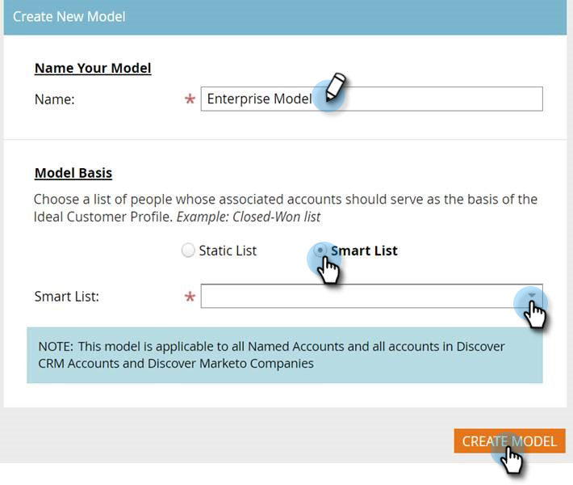

# Impostazione del profilo account {#setting-up-account-profiling}

Segui questi passaggi per iniziare a utilizzare Profiling account.

>[!CAUTION]
>
>I campi seguenti devono **not** essere nascosti per il corretto funzionamento del profilo account.
>
>* Sito web
>* Azienda
>* E-mail
>* Paese
>
>Scopri come [mostra qui un campo](/help/marketo/product-docs/administration/field-management/hide-and-unhide-a-field.md#unhide-a-field).

1. In My Marketo, apri **Gestione account di Target**.

   

1. Fai clic sul pulsante **Profilazione account** scheda .

   

1. La scheda Modello viene aperta per impostazione predefinita. Fai clic su **Introduzione**.

   

1. Assegna un nome al tuo modello e scegli il tipo/elenco di persone che fungeranno da base per il profilo cliente ideale (ICP). Fai clic su **Crea modello** al termine.

   

1. Il modello inizierà la sua creazione. Può volerci un po&#39;, ma non ti preoccupare, ti verrà comunicato quando sarà fatto.

   

1. Per visualizzare i risultati del modello, fai clic su **Vedi il risultato del modello**.

   

   Il modello viene ora creato.

   

   >[!TIP]
   >
   >Ora che il modello è stato creato, [impara a sintonizzarlo](/help/marketo/product-docs/target-account-management/account-profiling/account-profiling-ranking-and-tuning.md).
