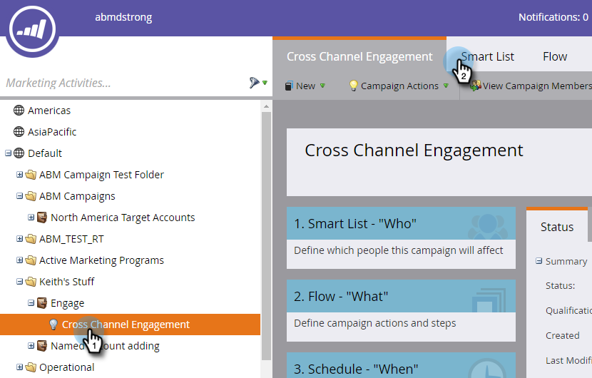
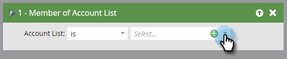

# Filtri account {#account-filters}

Identifica e coinvolge gli Account con nome e gli utenti tipo al loro interno utilizzando nuovi filtri incentrati sull&#39;account.

## Filtri ABM {#abm-filters}

1. Seleziona la campagna avanzata e fai clic su **Elenco avanzato**.

   

1. Fai clic su **+** per espandere la cartella **Filtri account** .

   

1. Trascinate i filtri da utilizzare nell’area di lavoro.

   

## Membro dell&#39;elenco dei conti {#member-of-account-list}

Per utilizzare questo filtro, fai clic sull&#39;elenco a discesa dell&#39;account..

...e scegli l&#39;elenco degli account desiderati.

>[!NOTE]
>
>Per il filtro Elenco membri account, esiste un solo qualificatore: &quot;is&quot; - Non sono disponibili qualificatori aggiuntivi (ad esempio &quot;is not&quot; e &quot;is any&quot;).

## Membro dell&#39;account denominato {#member-of-named-account}

1. Scegli un qualificatore. È per uno o più account denominati specifici o è uno qualsiasi per un account denominato.

   

1. Fai clic sull’elenco a discesa dell’account denominato .

   

1. Scegli gli account con nome desiderati.

   

1. Se utilizzi il qualificatore &quot;è qualsiasi&quot;, puoi utilizzare [vincoli](/help/marketo/product-docs/core-marketo-concepts/smart-lists-and-static-lists/using-smart-lists/add-a-constraint-to-a-smart-list-filter.md) per limitare i risultati della ricerca. Aggiungi quanti ne vorresti!

   

1. Imposta &quot;Include Children&quot; su false se desideri solo membri dal singolo account di primo livello. Selezionare true se si desidera che i membri vengano da tutti gli account figlio.

   

>[!MORELIKETHIS]
>
>[Trigger account](/help/marketo/product-docs/target-account-management/engage/account-triggers.md)
