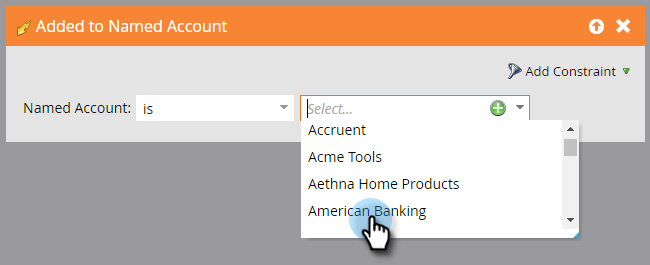

# Attivatori account {#account-triggers}

Ascolta e agisci su importanti attività comportamentali a livello di account tra diversi canali (ad esempio e-mail, web, annunci) utilizzando i trigger a livello di account.

Seleziona la tua campagna intelligente e fai clic su **[!UICONTROL Elenco avanzato]**.

Immettere &quot;Named Account&quot; nella casella di ricerca per trovare entrambi i trigger Named Account.

Trascina il trigger desiderato nell’area di lavoro. In questo esempio utilizziamo _Aggiunto all&#39;account denominato_.

Scegli un qualificatore.

Fai clic sull’elenco a discesa dell’account denominato...

...e scegli gli account denominati desiderati.

Tutto qui! Dopo aver completato il resto della campagna avanzata, ricordati di attivarla.

>[!MORELIKETHIS]
>
>[Filtri account](/help/marketo/product-docs/target-account-management/engage/account-filters.md)
