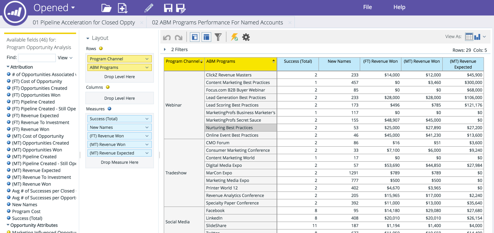

# Dimension di account denominato in RCA {#named-account-dimension-in-rca}

Crea rapporti basati sui ricavi utilizzando la dimensione Conto denominato specifica per TAM in Revenue Cycle Analytics.

>[!NOTE]
>
>**Dimension** - attributi (rappresentati da punti gialli) che forniscono viste diverse delle misure.

>[!NOTE]
>
>La dimensione Conto denominato in RCA può essere utilizzata per misurare l’impatto sul risultato finale dai conti target (ad esempio ricavi ottenuti, pipeline generata o accelerazione nel ciclo di vendita). Questa dimensione può essere utilizzata anche per identificare quali programmi hanno eseguito o non hanno eseguito correttamente i conti denominati.

I seguenti rapporti hanno accesso alla dimensione Conto denominato:

* Analisi e-mail
* Analisi dei lead
* Analisi dell’opportunità
* Analisi dell’iscrizione al programma

>[!NOTE]
>
>Di seguito sono riportati alcuni esempi di Marketo TAM in Revenue Cycle Analytics.

Accelerazione della pipeline all’interno di account denominati

Efficacia e successo del canale in base agli account denominati

Efficacia e impatto del programma sui profitti

Copertura di lead di qualità e coinvolgimento in account denominati

