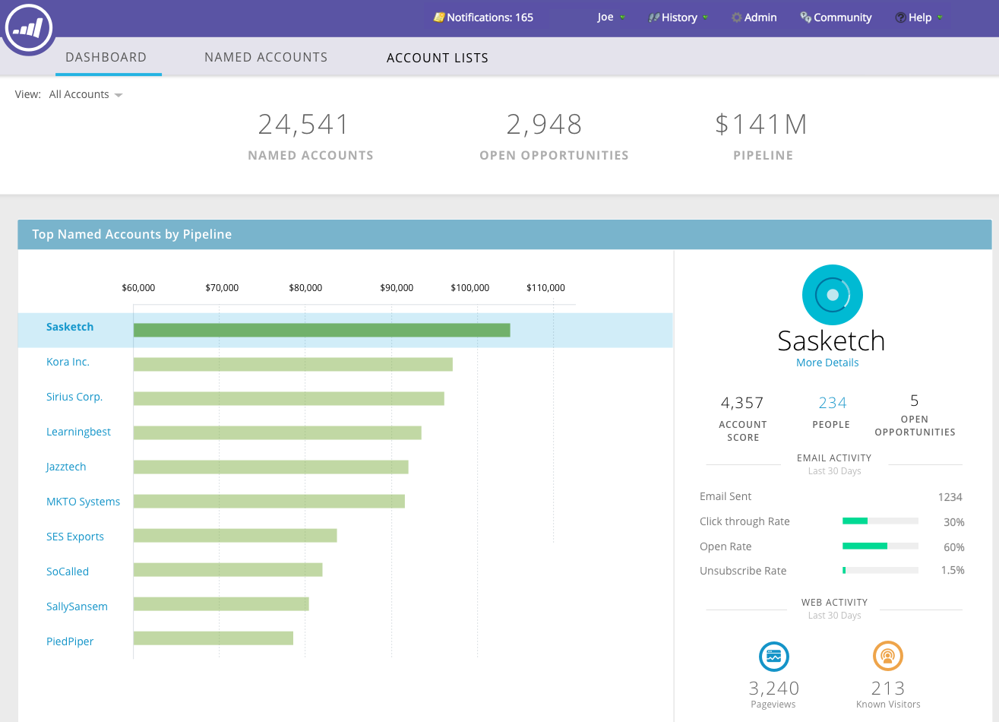

# Dashboard principale TAM {#tam-main-dashboard}

Il dashboard principale fornisce un riepilogo delle attività di [!UICONTROL Target Account Management]. Puoi visualizzare gli account target o gli elenchi di account che mostrano il successo e quelli che richiedono maggiore attenzione.

Per filtrare per elenco account, fare clic sull&#39;elenco a discesa **[!UICONTROL View]**...

...e fai una selezione. In questo esempio stiamo scegliendo l&#39;elenco account &quot;**[!UICONTROL High Tech]**&quot;.

Per visualizzare il [dashboard elenco account](/help/marketo/product-docs/target-account-management/measure/account-list-insights.md#account-list-dashboard), fare clic sul nome dell&#39;elenco account selezionato...

...e il dashboard viene caricato.

Se invece di visualizzare il dashboard Elenco account si desidera espandere un account denominato, fare clic su **[!UICONTROL More Details]** sotto il relativo nome...

...e visualizzare le informazioni sull&#39;[account denominato](/help/marketo/product-docs/target-account-management/measure/named-account-insights.md).

