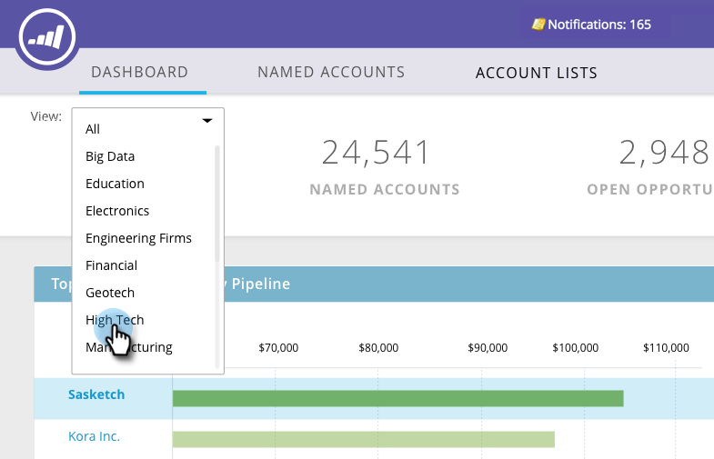

# Dashboard principale TAM {#tam-main-dashboard}

La dashboard principale fornisce un riepilogo delle attività di Gestione account di Target. Puoi visualizzare gli account target o gli elenchi di account che mostrano il successo e quelli che richiedono maggiore attenzione.

Per filtrare in base all’elenco degli account, fai clic sul menu a discesa Visualizza...

...e fai una selezione. In questo esempio, scegliamo il nostro elenco di account &quot;High Tech&quot;.

Per visualizzare [Dashboard elenco account](/help/marketo/product-docs/target-account-management/measure/account-list-insights.md#account-list-dashboard), fare clic sul nome dell&#39;elenco di account selezionato...

...e il dashboard viene caricato.

Se invece di visualizzare il dashboard Elenco account si desidera espandere un account denominato, fare clic su **Maggiori dettagli** sotto il suo nome...

...e visualizzare [approfondimenti dell’account denominato](/help/marketo/product-docs/target-account-management/measure/named-account-insights.md).

