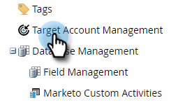

# Impostazione report TAM {#tam-report-setup}

Il rapporto vendite TAM è un messaggio e-mail settimanale personalizzato inviato al team dell&#39;account.

## Imposta rapporto {#report-setup}

1. Fai clic su **Amministratore**.

   

1. Fai clic su **Gestione account di destinazione**.

   

1. In Rapporto settimanale, fai clic su **Modifica**.

   

1. Fai clic sull’elenco a discesa **Giorno** e seleziona il giorno della settimana in cui i destinatari devono ricevere l’e-mail.

   

1. Per determinare il layout del messaggio e-mail, fai clic sul menu a discesa **Ordina per** e scegli una selezione.

   

1. Seleziona la casella di controllo **Utenti** , quindi fai clic sull&#39;elenco a discesa e seleziona il destinatario del messaggio e-mail.

   

   >[!NOTE]
   >
   >Le notifiche verranno inviate solo ai proprietari dell&#39;account o ai membri del team.

1. Fare clic su **Salva**.

   

Ed è tutto!

## Come annullare l&#39;iscrizione {#how-to-unsubscribe}

Ogni rapporto include l’opzione di rinuncia. Per farlo, fai clic su **Annulla sottoscrizione** in fondo all&#39;e-mail.

## Come effettuare l&#39;iscrizione {#how-to-resubscribe}

1. Fai clic su **Amministratore**.

   

1. Fai clic su **Gestione account di destinazione**.

   

1. In Rapporto settimanale, fare clic sul numero elencato come Non iscritto.

   

1. Fai clic sul menu a discesa **Utenti** .

   

1. Seleziona l&#39;utente che desideri ricevere nuovamente le e-mail e fai clic su **Ripristina**.

   
