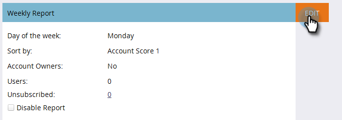

# Impostazione report TAM {#tam-report-setup}

Il rapporto sulle vendite TAM è un’e-mail personalizzata inviata settimanalmente al team dell’account.

## Configurazione del rapporto {#report-setup}

1. Fai clic su **[!UICONTROL Admin]**.

   

1. Fai clic su **[!UICONTROL Target Account Management]**.

   

1. In [!UICONTROL Weekly Report], fare clic su **[!UICONTROL Edit]**.

   

1. Fare clic sul menu a discesa **[!UICONTROL Day]** e selezionare il giorno della settimana in cui si desidera che i destinatari ricevano l&#39;e-mail.

   

1. Per determinare il layout dell&#39;e-mail, fare clic sul menu a discesa **[!UICONTROL Sort By]** e selezionare.

   

1. Selezionare la casella di controllo **[!UICONTROL Users]**, quindi fare clic sul menu a discesa e selezionare il destinatario dell&#39;e-mail.

   

   >[!NOTE]
   >
   >Le notifiche vengono inviate solo ai proprietari dell’account o ai membri del gruppo.

1. Fai clic su **[!UICONTROL Save]**.

   

Ed è tutto!

## Annullare l’abbonamento {#how-to-unsubscribe}

Ogni rapporto include l’opzione di rinuncia. Per farlo, fai clic su **[!UICONTROL Unsubscribe]** in fondo all&#39;e-mail.

## Come effettuare nuovamente la sottoscrizione {#how-to-resubscribe}

1. Fai clic su **[!UICONTROL Admin]**.

   

1. Fai clic su **[!UICONTROL Target Account Management]**.

   

1. In [!UICONTROL Weekly Report], fare clic sul numero indicato come [!UICONTROL Unsubscribed].

   

1. Fare clic sul menu a discesa **[!UICONTROL Users]**.

   

1. Selezionare l&#39;utente che si desidera ricevere nuovamente le e-mail e fare clic su **[!UICONTROL Resubscribe]**.

   
