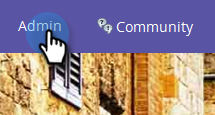
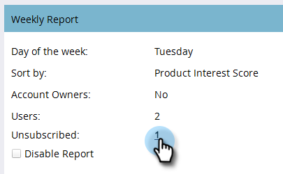

# Impostazione report TAM {#tam-report-setup}

Il rapporto sulle vendite TAM è un’e-mail personalizzata inviata settimanalmente al team dell’account.

## Configurazione del rapporto {#report-setup}

1. Clic **Amministratore**.

   

1. Clic **Gestione account di destinazione**.

   

1. In Rapporto settimanale, fai clic su **Modifica**.

   

1. Fai clic su **Giorno** e selezionare il giorno della settimana in cui si desidera che i destinatari ricevano l&#39;e-mail.

   

1. Per determinare il layout dell’e-mail, fai clic su **Ordina per** ed effettuare una selezione.

   

1. Controlla la **Utenti** , quindi fai clic sul menu a discesa e seleziona il destinatario dell’e-mail.

   

   >[!NOTE]
   >
   >Le notifiche vengono inviate solo ai proprietari dell’account o ai membri del gruppo.

1. Clic **Salva**.

   

Ed è tutto!

## Annullare l’abbonamento {#how-to-unsubscribe}

Ogni rapporto include l’opzione di rinuncia. Per farlo, fai clic su **Annulla iscrizione** nella parte inferiore dell’e-mail.

## Come effettuare nuovamente la sottoscrizione {#how-to-resubscribe}

1. Clic **Amministratore**.

   

1. Clic **Gestione account di destinazione**.

   

1. In Rapporto settimanale, fai clic sul numero indicato come Annullato abbonamento.

   

1. Fai clic su **Utenti** a discesa.

   

1. Seleziona di nuovo l’utente che desideri ricevere e-mail e fai clic su **Riscrivi**.

   
