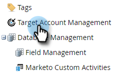
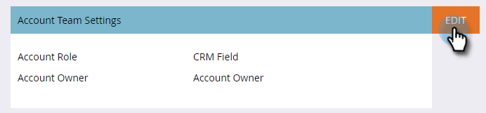
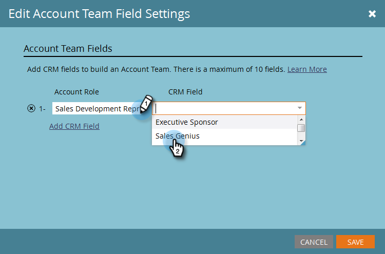

# Configurazione team account {#account-team-setup}

Un team di account è un gruppo di stakeholder che lavorano insieme su un account con nome. Segui questi passaggi per scegliere quali ruoli dell’account CRM aggiungere.

1. Fai clic su **[!UICONTROL Admin]**.

   

1. Fai clic su **[!UICONTROL Target Account Management]**.

   

1. In Membri team account fare clic su **[!UICONTROL Edit]**.

   

   >[!NOTE]
   >
   >Per [!UICONTROL Account Role], assegnargli un nome e confrontarlo con il campo di ricerca utente desiderato nel CRM.

1. Digita il tuo nome [!UICONTROL Account Role] e seleziona il campo **CRM**. Somma fino a 10.

   

   >[!NOTE]
   >
   >Impossibile selezionare [!UICONTROL Account Owner]. Viene scelto per impostazione predefinita dal livello account nel CRM.

1. Al termine, fai clic su **[!UICONTROL Save]**.

   

   >[!CAUTION]
   >
   >Se effettui un aggiornamento, la visualizzazione delle modifiche in TAM potrebbe impiegare del tempo.

   >[!NOTE]
   >
   >* Quando più account CRM con proprietari account diversi vengono uniti in un account denominato, Marketo sceglierà un &quot;Proprietario account&quot; e aggiungerà altri proprietari account come &quot;Proprietari account&quot;
   >
   >* Se un campo &quot;Ruolo&quot; del CRM viene successivamente rinominato o eliminato, Marketo TAM interromperà la sincronizzazione dei valori aggiornati fino a quando l’utente non aggiorna manualmente la configurazione in TAM
