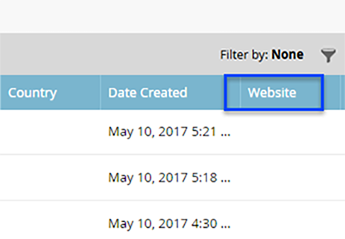

# Creazione di un campo personalizzato per l&#39;individuazione dei CRM {#create-a-custom-field-for-crm-discovery}

Aggiungi campi personalizzati agli account, mappali al tuo CRM e utilizzali per l&#39;individuazione degli account CRM in Marketo.

1. Fai clic su **Amministratore**.

   

1. Fai clic su **Gestione dei campi**, quindi **Nuovo campo personalizzato**.

   

1. Fai clic sul pulsante **Oggetto** a discesa e seleziona **Account denominato**.

   

1. Fai clic sul pulsante **Tipo** e seleziona un tipo.

   

1. Inserisci un **Nome** (il nome API verrà compilato automaticamente) e fai clic su **Crea**.

   

1. Dopo aver creato il campo, selezionalo dalla struttura a destra. Fai clic sul pulsante **Azioni campo** a discesa e seleziona **Mappa sul campo CRM**.

   

1. Seleziona il campo dell&#39;account CRM a cui desideri eseguire la mappatura e fai clic su **Salva**.

   

   Una volta sincronizzato, il nuovo campo verrà visualizzato all&#39;estrema destra nella griglia di Discover CRM.

   
