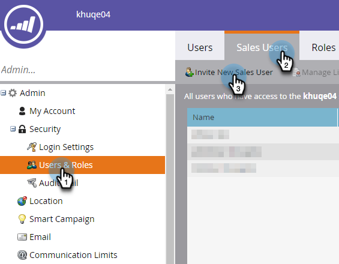
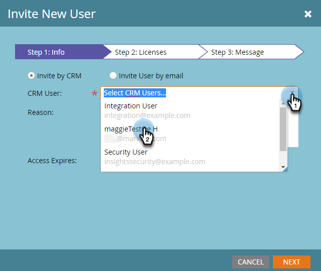
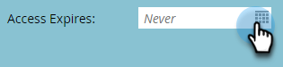
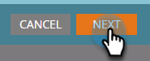
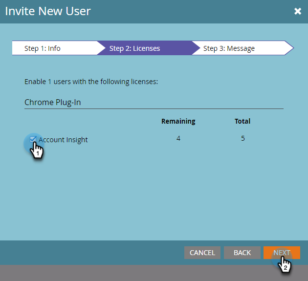
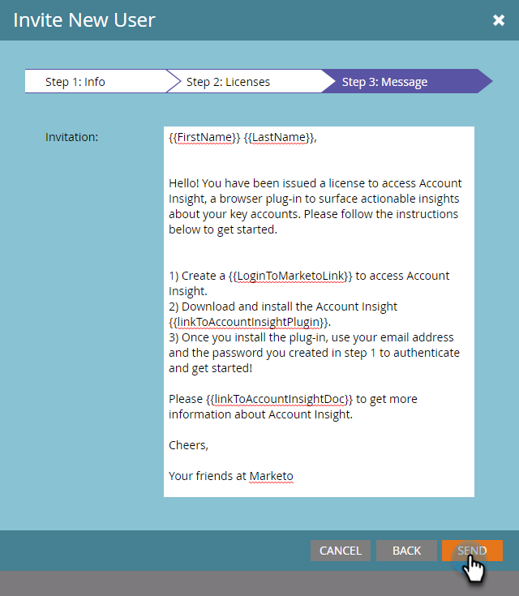

# Invita gli utenti ad accedere a [!UICONTROL Account Insight] {#invite-users-to-access-account-insight}

Seguire la procedura seguente per fornire agli utenti l&#39;accesso a [!UICONTROL Account Insight].

1. Fai clic su **[!UICONTROL Admin]**.

   

1. Fare clic su **[!UICONTROL Users & Roles]** nella struttura. Quindi fare clic sulla scheda **[!UICONTROL Sales Users]** e su **[!UICONTROL Invite New Sales User]**.

   

   Esistono due modi per invitare gli utenti: tramite CRM o e-mail. In questo esempio utilizzeremo Invito da CRM.

   >[!NOTE]
   >
   >Quando si invitano nuovi utenti (non Marketo) tramite l’elenco di utenti di CRM, è possibile invitare più persone alla volta. L&#39;invito tramite e-mail è 1 per 1.

1. Fare clic sul menu a discesa **[!UICONTROL CRM User]** e selezionare l&#39;utente desiderato.

   

   >[!NOTE]
   >
   >Se si sceglie **[!UICONTROL Invite User by email]**, è sufficiente immettere il nome, il cognome e l&#39;indirizzo di posta elettronica e continuare con il passaggio 4.

1. Per impostare una data di scadenza per l’accesso dell’utente (facoltativo), fai clic sull’icona del calendario. Per impostazione predefinita, è impostato su &quot;mai&quot;.

   

1. Fai clic su **[!UICONTROL Next]**.

   

1. Selezionare la casella di controllo **[!UICONTROL Account Insight]** e fare clic su **[!UICONTROL Next]**.

   

1. Controllare il messaggio inviato, apportare le modifiche desiderate (facoltative) e fare clic su **[!UICONTROL Send]**.

   
