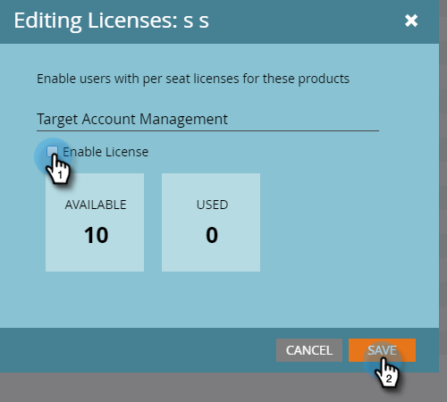

# Rilasciare una licenza {#issue-a-license}

Devi configurare gli utenti con una licenza per l’utilizzo di TAM. Ecco come farlo.

>[!NOTE]
>
>Il numero di licenze disponibili varia in base all’abbonamento. Per maggiori informazioni, contatta il tuo rappresentante commerciale.

1. Fai clic su **[!UICONTROL Admin]**.

   

1. Fai clic su **[!UICONTROL Users & Roles]**. Selezionare l&#39;utente a cui rilasciare la licenza, fare clic sull&#39;elenco a discesa **[!UICONTROL Issue License]** e selezionare **[!UICONTROL Target Account Management]**.

   

1. Selezionare la casella di controllo **[!UICONTROL Enable License]** e fare clic su **[!UICONTROL Save]**.

   

   >[!NOTE]
   >
   >Per rimuovere la licenza di un utente, seguire il passaggio 1, deselezionare la casella di controllo e fare clic su **[!UICONTROL Save]**.
