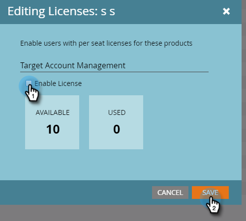

# Rilasciare una licenza {#issue-a-license}

Per utilizzare TAM dovrai configurare gli utenti con una licenza . Ecco come farlo.

>[!NOTE]
>
>Il numero di licenze disponibili varia in base all&#39;abbonamento. Se hai bisogno di più, contatta il tuo rappresentante commerciale.

1. Fai clic su **Amministratore**.

   

1. Fai clic su **Utenti e ruoli**. Seleziona l’utente a cui rilasciare la licenza, fai clic sul menu a discesa **Rilascia licenza** e seleziona **Gestione account di destinazione**.

   

1. Seleziona la casella di controllo **Abilita licenza** e fai clic su **Salva**.

   

   >[!NOTE]
   >
   >Per rimuovere la licenza di un utente, segui il passaggio 1, quindi deseleziona la casella di controllo e fai clic su **Salva**.
