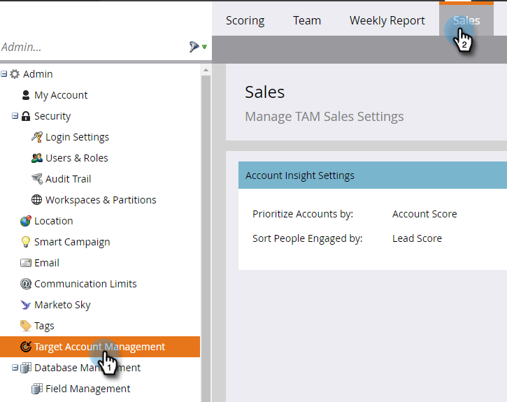

# Configurare Account Insight {#set-up-account-insight}

Ecco come impostare Account Insight.

>[!PREREQUISITES]
>
>Il punteggio account TAM [deve essere configurato per primo](/help/marketo/product-docs/target-account-management/setup-tam/account-score.md).

1. Fai clic su **Amministratore**.

   

1. Fai clic su **Gestione account di destinazione** nella struttura, quindi nella scheda **Vendite**.

   

1. Fare clic su **Modifica**.

   

1. Fai clic sull’elenco a discesa per scegliere in che modo Account Insight dà priorità agli account denominati e alle persone impegnate.

   

   >[!NOTE]
   >
   >Se le [impostazioni Punteggio account](/help/marketo/product-docs/target-account-management/setup-tam/account-score.md) vengono aggiornate in qualsiasi momento, la configurazione in Vendite deve essere aggiornata da un amministratore per assicurarsi che i punteggi riflettano con precisione le preferenze dell&#39;utente. Per visualizzare le modifiche, l’utente deve disconnettersi ed effettuare nuovamente l’accesso.

1. Fare clic su **Salva**.

   
