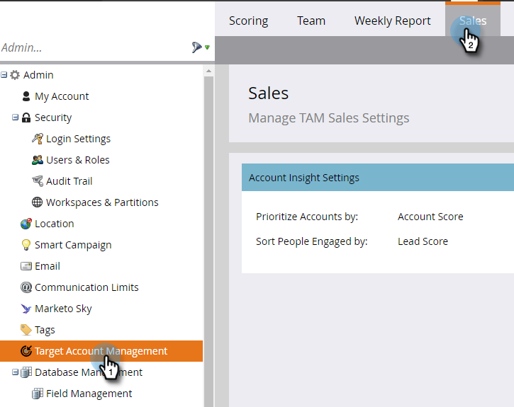

# Configurare account Insight {#set-up-account-insight}

Ecco come impostare Account Insight.

>[!PREREQUISITES]
>
>Il punteggio dell&#39;account TAM [&#x200B; deve prima essere configurato](/help/marketo/product-docs/target-account-management/setup-tam/account-score.md).

1. Fai clic su **[!UICONTROL Admin]**.

   

1. Fare clic su **[!UICONTROL Target Account Management]** nella struttura, quindi sulla scheda **[!UICONTROL Sales]**.

   

1. Fai clic su **[!UICONTROL Edit]**.

   

1. Fai clic sui menu a discesa per scegliere il modo in cui Insight account assegna priorità agli account denominati e alle persone coinvolte.

   

   >[!NOTE]
   >
   >Se le [impostazioni del punteggio account](/help/marketo/product-docs/target-account-management/setup-tam/account-score.md) vengono aggiornate in qualsiasi momento, la configurazione in Vendite deve essere aggiornata da un amministratore per assicurarsi che i punteggi riflettano accuratamente le preferenze dell&#39;utente. L’utente deve disconnettersi ed effettuare di nuovo l’accesso per visualizzare le modifiche.

1. Fai clic su **[!UICONTROL Save]**.

   
