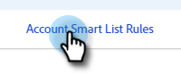

# Elenchi avanzati account {#account-smart-lists}

Ecco come identificare in modo rapido e preciso gli account di alto valore.

>[!NOTE]
>
>Questa funzione è disponibile solo per coloro che dispongono sia del componente aggiuntivo Gestione account di Target che di una licenza TAM rilasciata.

## Creare un elenco avanzato account {#create-an-account-smart-list}

1. In Marketo, vai a **Attività di marketing**.

   

1. Trova e seleziona il programma desiderato.

   

1. Fai clic sul pulsante **Nuovo** a discesa e seleziona **Nuova risorsa locale**.

   

1. Fai clic su **Elenco avanzato account**.

   

1. Immetti un nome e fai clic su **Crea** (Descrizione ed etichette sono facoltative).

   

Il tuo Account Smart List è stato creato. Vedi sotto per i passaggi per la definizione delle sue regole.

## Regole di elenco avanzato account {#account-smart-list-rules}

Gli elenchi smart account funzionano in modo simile agli elenchi smart standard, con un&#39;eccezione notevole: contenitori.

1. Per definire l’elenco avanzato dell’account, fai clic sul pulsante **Regole di elenco avanzato account** scheda .

   

1. Scegli i filtri account desiderati. In questo esempio scegliamo _Il settore sanitario_.

   

   

   >[!NOTE]
   >
   >Dati dell&#39;indicatore ICP utilizzati nel [Classificazione e tuning del profilo dell&#39;account](/help/marketo/product-docs/target-account-management/account-profiling/account-profiling-ranking-and-tuning.md) verrà visualizzato come Attributi account personalizzati da utilizzare nel tuo Elenco smart account. Questi dati di attributi personalizzati si basano su quando è stato creato/aggiornato il modello di profilo account.

1. Scegli i filtri persona corrispondenti. In questo esempio scegliamo _Lo stato è la California_.

   

**Passaggio facoltativo**: Ecco dove entrano i contenitori. Se scegli un filtro persona aggiuntivo corrispondente, puoi trascinarlo sotto il primo, oppure _in_ creazione di un contenitore. In questo esempio viene creato un contenitore aggiungendo _Il titolo del processo è CFO_.

Ecco come apparirà il contenitore.

>[!NOTE]
>
>La creazione di un contenitore di filtri crea una regola &quot;e&quot;, il che significa che restituisce solo tutti i risultati combinati. In questo esempio, account con un&#39;industria sanitaria, oltre ad essere situato in California _e_ con qualcuno elencato come CFO. Se non desideri utilizzare i contenitori, rilascia semplicemente il filtro sotto o sopra quello esistente.

Ed è tutto! Consulta la sezione seguente per scoprire come sfruttare il tuo Account Smart List.

>[!TIP]
>
>Come per gli elenchi avanzati standard, puoi utilizzare la logica avanzata per perfezionare ulteriormente i risultati. Per farlo, sono necessari almeno tre filtri e in Elenchi avanzati account un contenitore (indipendentemente dal numero di filtri che contiene) è uguale a un filtro.

## Azioni di elenco avanzato account {#account-smart-list-actions}

Nella scheda Panoramica dell’elenco avanzato account, noterai alcune opzioni di azione.

**Esporta**: In questo modo i risultati dell’elenco avanzato account vengono esportati come CSV.

**Clona**: Crea una copia del tuo Account Smart List.

**Invia ad Network**: Invia l’elenco a LinkedIn come nuovo pubblico con corrispondenza.

Puoi anche fare riferimento al tuo Account Smart List in una Smart Campaign/List standard utilizzando _Persone membro dell’elenco avanzato account_ filtro.

>[!NOTE]
>
>I risultati del membro persone dell’elenco smart dell’account mostreranno ogni persona negli account identificati, non solo le persone che si trovano tramite filtri a persona abbinata nell’elenco smart dell’account.

>[!NOTE]
>
>**Definizione**
>
>**Persone membro dell’elenco avanzato account**: In questo caso la parola &quot;membro&quot; si riferisce all&#39;account stesso, quindi &quot;membro della gente&quot; significa la persona effettiva (record Marketo) in tali account.
