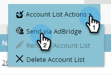

# Creare un pubblico abbinato su LinkedIn {#create-a-matched-audience-on-linkedin}

Crea tipi di pubblico corrispondenti dagli elenchi degli account ABM per il targeting degli annunci LinkedIn.

>[!PREREQUISITES]
>
>[Aggiungere tipi di pubblico corrispondenti LinkedIn come servizio LaunchPoint](/help/marketo/product-docs/demand-generation/ad-network-integrations/add-linkedin-matched-audiences-as-a-launchpoint-service.md)

1. In ABM, fai clic sulla scheda **Elenchi account** .

   

1. Scegli l&#39;elenco di account desiderato.

   

1. Fai clic sul menu a discesa **Azioni elenco account** e seleziona **Invia tramite AdBridge**.

   

1. Scegli **LinkedIn** e fai clic su **Avanti**.

   

1. Fai clic sul menu a discesa **Pubblico** . Puoi selezionare un pubblico esistente o crearne uno nuovo. In questo esempio, ne creeremo uno nuovo (se selezioni un pubblico esistente, passa al Passaggio 7).

   

1. Fai clic sull&#39;elenco a discesa **Ad Account** e seleziona l&#39;account dell&#39;annuncio di destinazione.

   

1. Assegna un nome al pubblico e fai clic su **Aggiorna**.

   

   Ed è tutto. Il pubblico è stato inviato a LinkedIn.

>[!MORELIKETHIS]
>
>[Utilizzare un elenco Marketo o un elenco avanzato come segmento di pubblico collegato](/help/marketo/product-docs/demand-generation/social/social-functions/use-a-marketo-list-or-smart-list-as-a-linkedin-audience-segment.md)
