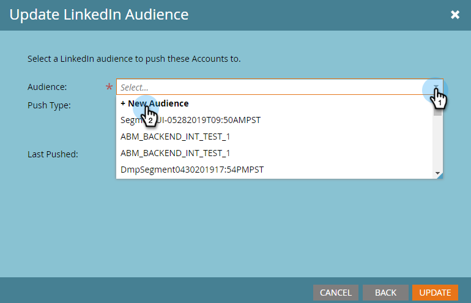
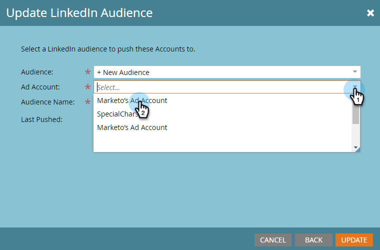

# Crea un pubblico con account corrispondente in [!DNL LinkedIn] {#create-an-account-matched-audience-on-linkedin}

Crea i tipi di pubblico corrispondenti all&#39;account dagli elenchi di account TAM per [[!DNL LinkedIn] Ad Targeting](https://business.linkedin.com/marketing-solutions/ad-targeting/account-targeting). [!DNL LinkedIn] abbinerà l&#39;elenco agli account nel loro sistema e puoi creare un pubblico [!DNL LinkedIn] basato su tale elenco di account da attivare tra [!DNL LinkedIn] canali. Questo consente agli addetti al marketing di eseguire il targeting delle persone che si trovano all’interno o all’esterno del database.

>[!PREREQUISITES]
>
>[Aggiungi [!DNL LinkedIn] Tipi di pubblico corrispondenti come servizio LaunchPoint](/help/marketo/product-docs/demand-generation/ad-network-integrations/add-linkedin-matched-audiences-as-a-launchpoint-service.md)

1. In TAM, fare clic sulla scheda **[!UICONTROL Account Lists]**.

   

1. Scegli l’elenco degli account desiderati.

   

1. Fai clic sul menu a discesa **[!UICONTROL Account List Actions]** e seleziona **[!UICONTROL Send via AdBridge]**.

   

1. Scegliere **[!DNL LinkedIn]** e fare clic su **[!UICONTROL Next]**.

   

1. Fare clic sul menu a discesa **[!UICONTROL Audience]**. Puoi selezionare un pubblico esistente o crearne uno nuovo. In questo esempio ne creeremo uno nuovo (se selezioni un pubblico esistente, passa al passaggio 7).

   

1. Fare clic sull&#39;elenco a discesa **[!UICONTROL Ad Account]** e selezionare l&#39;account dell&#39;annuncio di destinazione.

   

1. Assegna un nome al pubblico e fai clic su **[!UICONTROL Update]**.

   

Ed è tutto. Push dell&#39;elenco di account eseguito su [!DNL LinkedIn].

>[!MORELIKETHIS]
>
>[Utilizza un elenco Marketo o un elenco avanzato come  [!DNL LinkedIn] segmento di pubblico](/help/marketo/product-docs/demand-generation/social/social-functions/use-a-marketo-list-or-smart-list-as-a-linkedin-audience-segment.md)
