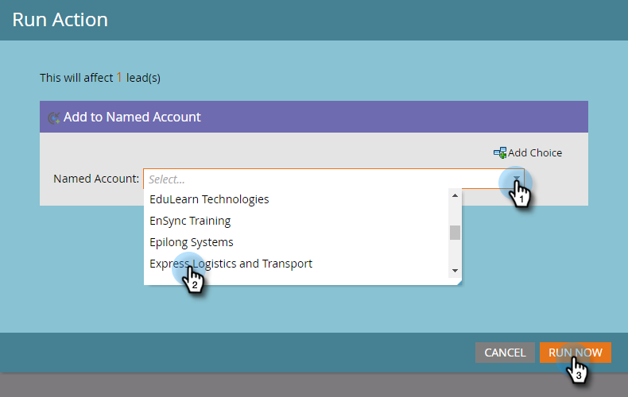

# Aggiungere persone a un account denominato {#add-people-to-a-named-account}

Sono disponibili tre modi diversi per aggiungere manualmente le persone a un account denominato in TAM.

## Azione a flusso singolo {#single-flow-action}

1. Fai clic su **Database**.

   

1. Immettere l&#39;indirizzo e-mail della persona e premere Invio.

   

1. Fai clic sulla persona per selezionarla. Fai clic sul pulsante **Azioni personali** a discesa, fai clic su **Marketing** e seleziona **Aggiungi a account con nome**.

   

1. Fai clic sul pulsante **Account denominato** a discesa, seleziona l&#39;account con nome desiderato e fai clic su **Esegui ora**.

   

## Passaggio al flusso di una campagna intelligente {#smart-campaign-flow-step}

1. Seleziona la tua Smart Campaign e fai clic su **Flusso**.

   

1. Nella casella di ricerca immetti &quot;Aggiungi a account con nome&quot;.

   

1. Trascina il filtro sull’area di lavoro.

   

1. Fai clic sul pulsante **Account denominato** e seleziona l&#39;account denominato desiderato.

   

   Tutto qui! Ora pianifica (o attiva) la tua campagna avanzata e la fase di flusso inizierà ad aggiungere persone qualificate all’account designato.

## Importazione elenco {#list-import}

1. Seleziona l’elenco e fai clic sul pulsante **Azioni elenco** a discesa e seleziona **Importa elenco**.

   

1. Dopo aver scelto il file e le impostazioni, fai clic su **Successivo**.

   

1. Mappa i campi desiderati. Assicurati che **Account denominato** campo mappato.

   

1. Scegli le impostazioni desiderate, quindi fai clic su **Importa**.

   

>[!MORELIKETHIS]
>
>[Corrispondenza lead a conto](/help/marketo/product-docs/target-account-management/target/named-accounts/lead-to-account-matching.md)
