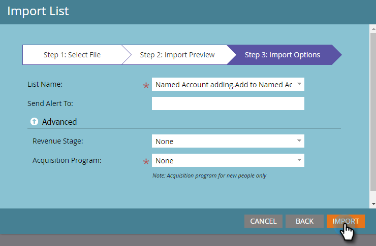

# Aggiungi persone a [!UICONTROL Named Account] {#add-people-to-a-named-account}

Esistono tre modi diversi per aggiungere manualmente persone a un account denominato in TAM.

## Azione flusso singolo {#single-flow-action}

1. Fai clic su **[!UICONTROL Database]**.

   

1. Inserisci l’indirizzo e-mail della persona e premi Invio.

   

1. Fai clic sulla persona per selezionarla. Fare clic sull&#39;elenco a discesa **[!UICONTROL Person Actions]**, fare clic su **[!UICONTROL Marketing]** e selezionare **[!UICONTROL Add to Named Account...]**.

   

1. Fare clic sull&#39;elenco a discesa **[!UICONTROL Named Account]**, selezionare [!UICONTROL Named Account] desiderato e fare clic su **[!UICONTROL Run Now]**.

   

## Passaggio di flusso di Smart Campaign {#smart-campaign-flow-step}

1. Seleziona la tua campagna avanzata e fai clic su **[!UICONTROL Flow]**.

   

1. Nella casella di ricerca immettere &quot;[!UICONTROL Add to Named Account]&quot;.

   

1. Trascina il filtro nell’area di lavoro.

   

1. Fare clic sul menu a discesa **[!UICONTROL Named Account]** e selezionare il [!UICONTROL Named Account] desiderato.

   

   Tutto qui. Successivamente, pianifica (o attiva) la tua campagna avanzata e, nel passaggio del flusso, verranno aggiunte persone qualificate all’account denominato designato.

## Importazione elenco {#list-import}

1. Selezionare l&#39;elenco, fare clic sul menu a discesa **[!UICONTROL List Actions]** e selezionare **[!UICONTROL Import List]**.

   

1. Dopo aver scelto il file e le impostazioni, fare clic su **[!UICONTROL Next]**.

   

1. Mappa i campi desiderati. Assicurarsi che il campo **[!UICONTROL Named Account]** sia mappato.

   

1. Scegli le impostazioni desiderate, quindi fai clic su **[!UICONTROL Import]**.

   

>[!MORELIKETHIS]
>
>[Lead per corrispondenza account](/help/marketo/product-docs/target-account-management/target/named-accounts/lead-to-account-matching.md)
