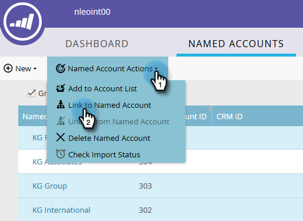

# Creare una gerarchia {#create-a-hierarchy}

Le gerarchie devono essere create in CRM. Tuttavia, se non disponi di un CRM, segui questi passaggi per creare manualmente una gerarchia.

1. In [!UICONTROL Named Accounts], fare clic sulla casella di controllo **[!UICONTROL Group by Hierarchy]**.

   

   >[!NOTE]
   >
   >Per creare manualmente una gerarchia è possibile utilizzare solo account non CRM. Gli account collegati a CRM devono avere le loro gerarchie create nel CRM.

1. Utilizzando i comandi Ctrl-clic (Windows) o Comando-clic (Mac), selezionare tutti gli account che si desidera raggruppare in una gerarchia.

   

1. Fai clic sul menu a discesa **[!UICONTROL Named Account Actions]** e seleziona **[!UICONTROL Link to Named Account]**.

   

   >[!NOTE]
   >
   >Per scollegare gli account, seguire la procedura descritta sopra, ma scegliere **[!UICONTROL Unlink From Named Account]**.

1. Selezionare un account con nome padre dal menu a discesa e fare clic su **[!UICONTROL Link]**.

   

1. Gli account denominati fanno ora parte di una gerarchia. Fai clic sulla freccia a sinistra per visualizzare tutti i relativi account figlio.

   
