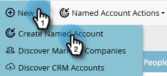

# Creare un account denominato {#create-a-named-account}

Segui questi passaggi per creare manualmente un account denominato.

1. In Account con nome, fai clic sul menu a discesa **Nuovo** e seleziona **Crea account con nome**.

   

1. Compila i campi desiderati e fai clic su **Crea**.

   

   >[!TIP]
   >
   >Fai clic direttamente su un account denominato per visualizzarne il dashboard.

>[!MORELIKETHIS]
>
>[Aggiungere persone a un account denominato](/help/marketo/product-docs/target-account-management/target/named-accounts/add-people-to-a-named-account.md)
