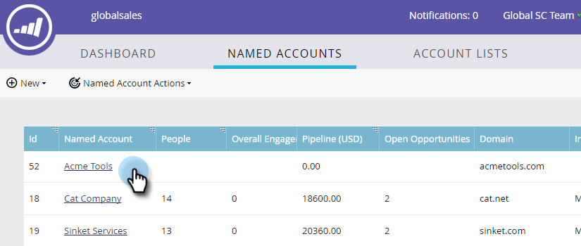
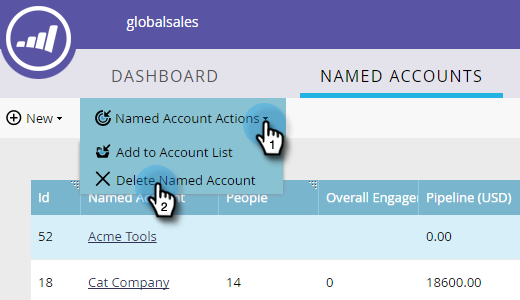

# Elimina [!UICONTROL Named Account] {#delete-a-named-account}

Per eliminare un account denominato, segui la procedura rapida riportata di seguito.

1. Selezionare la riga degli account denominati che si desidera eliminare.

   

   >[!NOTE]
   >
   >Per selezionare più account denominati, premere Ctrl+clic (Windows) o Comando+clic (Mac).

1. Fai clic sul menu a discesa **[!UICONTROL Named Account Actions]** e seleziona **[!UICONTROL Delete Named Account]**.

   

1. Fai clic su **[!UICONTROL Delete]**.

   

   >[!NOTE]
   >
   >Gli account sincronizzati con il CRM non possono essere eliminati in TAM. Se l&#39;opzione Elimina non è disponibile o se si riceve il messaggio &quot;Questi account non possono essere eliminati perché uno o più account CRM sono selezionati&quot;, è necessario eliminarli direttamente nel CRM.
