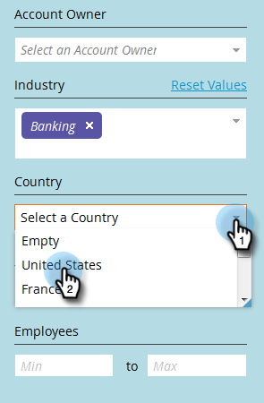
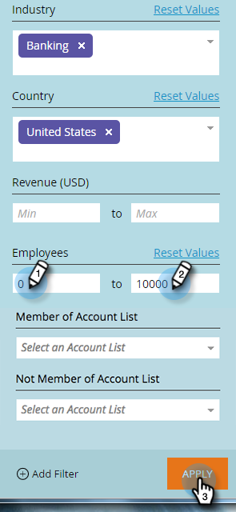

# Filtro in [!UICONTROL Named Accounts] {#filtering-in-named-accounts}

Il filtro è un ottimo modo per limitare i dati rapidamente.

>[!NOTE]
>
>I dati nei menu a discesa dei filtri riflettono tutti i campi disponibili nel CRM che sono stati sincronizzati con Marketo.

1. Fai clic sull’icona del filtro.

   

   >[!NOTE]
   >
   >Sono disponibili diverse combinazioni di parametri di ricerca. In questo esempio viene individuato: _[!UICONTROL Industry]= banca, [!UICONTROL Country] = Stati Uniti, Max [!UICONTROL Employees] = 10000_.

1. Fai clic sul menu a discesa **[!UICONTROL Industry]** e seleziona **[!UICONTROL Banking]**.

   

1. Fai clic sul menu a discesa **[!UICONTROL Country]** e seleziona **[!UICONTROL United States]**.

   

1. In **[!UICONTROL Employees]**, digitare &quot;0&quot; nel campo **Min**, &quot;10000&quot; nel campo **Max**, quindi fare clic su **[!UICONTROL Apply]**.

   

   I risultati filtrati vengono visualizzati sul lato sinistro della schermata.

   >[!NOTE]
   >
   >Per aggiungere altri filtri tra cui scegliere, fai clic su **[!UICONTROL Add Filter]** in basso a sinistra nel modulo.
