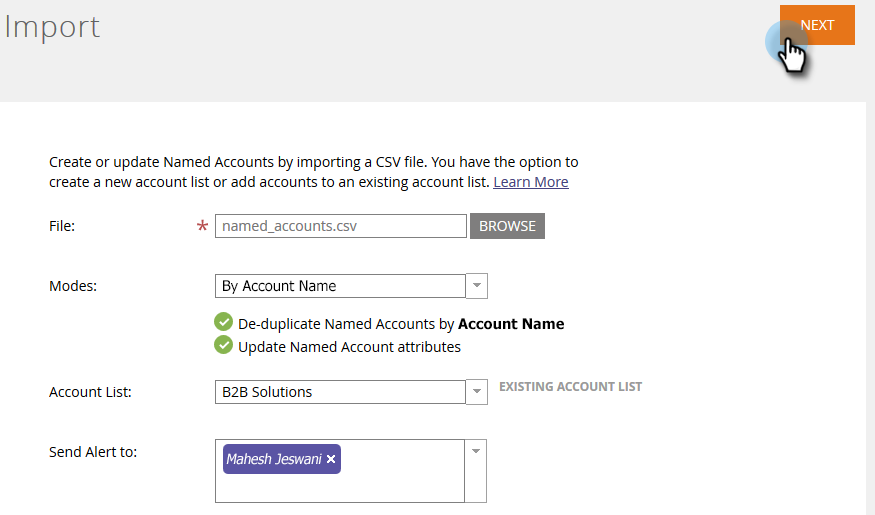

# Importa account denominati {#import-named-accounts}

Hai già un file CSV pieno di potenziali account di destinazione? Importateli direttamente in TAM!

1. Fai clic su **Nuovo** a discesa e selezionare **Importa account denominati**.

   

1. Si aprirà una nuova finestra. Clic **Sfoglia**, quindi selezionare il file di account denominati da importare.

   

   >[!TIP]
   >
   >Nel file, fornisci [quante informazioni](/help/marketo/product-docs/target-account-management/target/named-accounts/named-account-overview.md#named-account-attributes) il più possibile. È possibile aggiungere solo informazioni firmografiche; nulla viene calcolato da Marketo (ad esempio, pipeline). Per creare account denominati basati su account CRM, è sufficiente esportare il nome account e l’ID CRM dal CRM in un file CSV, utilizzare l’opzione Nome account e mappare l’ID CRM durante il processo di importazione. Per collegare correttamente un account CRM a un account denominato, è necessario fornire il nome esatto dell&#39;account CRM.

1. È possibile scegliere tra due modalità di deduplicazione: Nome account o Nome dominio. In questo esempio sceglieremo Account. Fai clic su **Modalità** a discesa e selezionare **Per nome account**.

   

   >[!NOTE]
   >
   >Se si sceglie **Per modalità dominio**, devono essere inclusi sia i campi account denominato che quelli dominio.

1. Per scegliere l&#39;elenco di account a cui aggiungere l&#39;account con nome, fare clic su **Elenco account** ed effettuare la selezione.

   

   >[!NOTE]
   >
   >Puoi anche creare un nuovo elenco account digitandone semplicemente il nome nella casella a discesa.

1. Per inviare una notifica dell&#39;importazione, fare clic sul pulsante **Invia avviso a** e selezionare un utente Marketo. Tu _non può_ immetti manualmente un indirizzo e-mail.

   

1. Clic **Successivo**.

   

1. Mappare ogni campo facendo doppio clic sul pulsante **Campo Marketo** e selezionando il campo appropriato. Clic **Successivo** al termine.

   

   Completato!

   

   >[!NOTE]
   >
   >&quot;Controlla stato importazione&quot; mostra solo gli ultimi tre giorni di attività.

Scenari di deduplicazione in base al nome account:

<table> 
 <tbody> 
  <tr> 
   <td><strong>Importazione record con nome account denominato esistente</strong></td> 
   <td>
Il record esistente verrà aggiornato
</td> 
  </tr> 
  <tr> 
   <td><strong>Importazione del record con il nuovo nome account denominato</strong></td> 
   <td>Verrà creato un nuovo record</td> 
  </tr> 
 </tbody> 
</table>

Scenari di deduplicazione in base al nome dominio:

<table> 
 <tbody> 
  <tr> 
   <td><strong>Importazione di record con un nuovo nome account e un nuovo nome dominio</strong></td> 
   <td>Creeremo un nuovo Account Named con le informazioni fornite</td> 
  </tr> 
  <tr> 
   <td><strong>Importazione del record con un nome account e un nome dominio esistenti</strong></td> 
   <td>Verrà aggiornato l’account denominato esistente</td> 
  </tr> 
   <tr> 
   <td><strong>Importazione del record con un nuovo nome account e un nome dominio esistente</strong></td> 
   <td>Aggiungeremo il nuovo nome account all’account denominato esistente che corrisponde al nome di dominio e aggiorneremo altre informazioni (ad esempio, settore, stato, ecc.)</td> 
  </tr> 
  <tr> 
   <td><strong>Importazione record con nome account denominato esistente e nuovo nome dominio</strong></td> 
   <td>Aggiungeremo il nuovo nome di dominio all’account denominato esistente che corrisponde al nome dell’account e aggiorneremo altre informazioni (ad esempio, settore, stato, ecc.)</td> 
  </tr> 
 </tbody> 
</table>

>[!NOTE]
>
>Quando Marketo aggiunge un account denominato, si aggiorna una regola (dietro le quinte) che consente di identificare le persone che dovrebbero far parte dell’account denominato. Esempio: se aggiorni &quot;IBM&quot; in &quot;IBM, USA&quot;, le persone con uno dei due nomi di società saranno associate all’account denominato.

Se Marketo trova record che consideriamo duplicati, elaborerà solo il primo.
