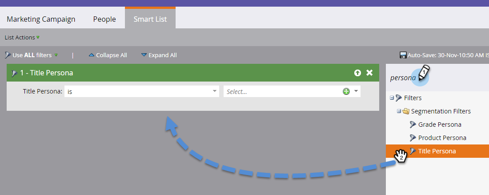

# Utilizzo di Personas {#using-personas}

Le persone sono un ottimo modo per segmentare il pubblico e il mercato ABM a un sottoinsieme specifico di persone.

## Aggiungi una Persona {#add-a-persona}

1. In My Marketo, fai clic su **Amministratore**.

   

1. Nella struttura, seleziona **Gestione account di destinazione**.

   

1. Fare clic su **Modifica**.

   

   >[!NOTE]
   >
   >L’utente tipo Titolo processo è incluso per impostazione predefinita. Non può essere modificato o eliminato.

1. Per aggiungere altri utenti tipo, fai clic su **+Aggiungi**.

   

1. Assegna un nome alla tua persona e seleziona il campo corrispondente nel menu a discesa. Puoi aggiungere fino a due utenti tipo aggiuntivi. Al termine, fai clic su **Salva**.

   

   >[!NOTE]
   >
   >Solo i campi personalizzati Salesforce di tipo &quot;elenco di selezione&quot; sincronizzati nell’istanza Marketo sono disponibili nel menu a discesa del campo utente durante la creazione di una persona.

## Visualizza i tuoi utenti {#view-your-personas}

Visualizza i tuoi utenti tipo visitando uno specifico account con nome.

1. Seleziona l&#39;account denominato desiderato.

   

1. Fai clic sulla scheda **Personas** .

   

1. Tutti i tuoi utenti tipo sono elencati. Fai clic su un numero per visualizzare l’elenco delle persone.

   

   >[!NOTE]
   >
   >La X nel titolo Persona agisce come un carattere jolly. Ad esempio, &quot;CXO&quot; includerà amministratori delegati, CFO, ecc.

## Filtri Persona {#persona-filters}

1. Utilizza i filtri dell’utente tipo in un elenco avanzato per vendere a un gruppo specifico di persone.

