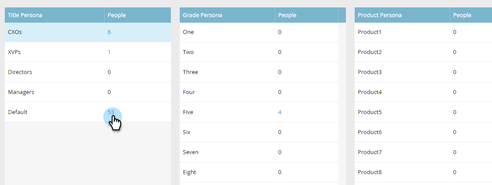

# Utilizzo di utenti tipo {#using-personas}

Gli utenti tipo sono un ottimo modo per segmentare il pubblico e il mercato ABM per un sottoinsieme specifico di persone.

## Aggiungi una persona {#add-a-persona}

1. In Il mio Marketo, fai clic su **[!UICONTROL Admin]**.

   

1. Nella struttura, selezionare **[!UICONTROL Target Account Management]**.

   

1. Fai clic su **[!UICONTROL Edit]**.

   

   >[!NOTE]
   >
   >La persona Qualifica è inclusa per impostazione predefinita. Non può essere modificata o eliminata.

1. Per aggiungere altri utenti tipo, fare clic su **[!UICONTROL +Add]**.

   

1. Assegna un nome all’utente tipo e seleziona il campo corrispondente nel menu a discesa. Puoi aggiungere fino a due utenti tipo aggiuntivi. Al termine, fai clic su **[!UICONTROL Save]**.

   

   >[!NOTE]
   >
   >Solo i campi personalizzati Salesforce di tipo &quot;elenco a discesa&quot; che sono stati sincronizzati con l’istanza Marketo sono disponibili nel menu a discesa del campo persona durante la creazione di un utente tipo.

## Visualizza i tuoi utenti tipo {#view-your-personas}

Visualizza i tuoi utenti tipo visitando un [!UICONTROL Named Account] specifico.

1. Selezionare il [!UICONTROL Named Account] desiderato.

   

1. Fai clic sulla scheda **[!UICONTROL Personas]**.

   

1. Tutti i tuoi utenti tipo sono elencati. Fai clic su un numero per visualizzare l’elenco delle persone.

   

   >[!NOTE]
   >
   >La X in [!UICONTROL Title Persona] funge da carattere jolly. Ad esempio, &quot;CXO&quot; includerà CEO, CFO, ecc.

## Filtri persona {#persona-filters}

1. Utilizza i filtri utente in un elenco avanzato per effettuare la commercializzazione a un gruppo specifico di persone.

