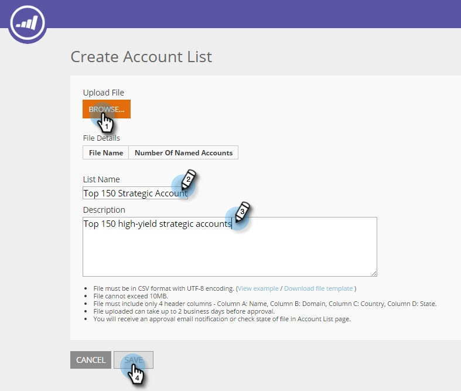

# Crea un nuovo elenco account {#create-a-new-account-list}

Crea e carica un elenco di nomi di organizzazione e dominio per eseguire il targeting di questi account chiave con campagne personalizzate.

>[!NOTE]
>
>Questo articolo si applica solo ai clienti ABM Web legacy. Se hai acquisito Web ABM dopo settembre 2016, segui i passaggi descritti in [questo articolo](https://docs.marketo.com/display/DOCS/Account+Lists#AccountLists-CreateaNewAccountList) invece.

## Crea un nuovo elenco account {#create-a-new-account-list-1}

1. Vai a **Elenchi account**.

   

1. Seleziona **Crea nuovo**.

   

1. Seleziona **Sfoglia** e carica il file CSV (assicurati che il file CSV soddisfi i criteri). Aggiungi un **Nome** e **Descrizione**. Clic **Salva**.

   

   >[!NOTE]
   >
   >**Qual è il formato del file CSV?**
   >
   >Assicurati che il file CSV dell’account denominato soddisfi i seguenti requisiti:
   >
   >* Salvato come formato CSV
   >* Non supera i 10 MB
   >* Solo 4 colonne con intestazione Colonna A: Nome, Colonna B: Dominio, Colonna C: Paese, Colonna D: Stato USA.
   >* Il caricamento del file può richiedere fino a 2 giorni lavorativi prima dell’approvazione.
   >* Riceverai una notifica e-mail di approvazione o controllerai lo stato del file nella pagina Account denominati.
   >* Il numero totale di record/righe accumulati per tutti gli elenchi caricati inizia a 10.000, con il pacchetto più grande che ammonta a 100.000.

   >[!NOTE]
   >
   >**Esempio di file CSV**
   >
   >* Riga 1 Colonna A valore = Organizzazione
   >* Riga 1 Colonna B valore = Dominio
   >* Riga 1 Colonna C valore = Paese
   >* Riga 1 Colonna D valore = Stato USA
   >* Uno dei valori della colonna è obbligatorio. Tuttavia, l’indicazione dei nomi di organizzazione e di dominio migliora le percentuali di corrispondenza dell’elenco degli account.
   >* Paese e Stato sono valori facoltativi.
   >
   >   * Per il nome del paese, utilizzare il nome completo del paese o il codice abbreviato. Esempio: Stati Uniti o Stati Uniti.
   >   * Per uno Stato degli Stati Uniti, utilizzare il codice di abbreviazione di 2 lettere, ad esempio CA. Sono riconosciuti solo gli stati degli Stati Uniti.
   >
   >

## Modificare un elenco di account {#edit-an-account-list}

Il giorno **Elenchi account** , fare clic su **Modifica** sull&#39;elenco.

Seleziona **Sfoglia** e carica il nuovo file CSV. Questo file sostituirà il file originale. Clic **Salva**. Il nuovo file caricato rimarrà in sospeso fino all&#39;approvazione da parte del supporto tecnico Marketo, mentre il file originale rimarrà attivo in sospeso.

Il file CSV sostituirà il file esistente. L&#39;elenco esistente rimarrà attivo fino al completamento dell&#39;elaborazione del nuovo file.

## Eliminare un elenco di account denominati {#delete-a-named-account-list}

1. Il giorno **Elenchi account** fare clic sull&#39;icona Elimina dell&#39;elenco che si desidera eliminare.

   

1. Viene visualizzato un messaggio per confermare se si desidera eliminare l&#39;elenco. Clic **OK**.

   

>[!MORELIKETHIS]
>
>[Creare un segmento utilizzando un elenco di conti](/help/marketo/product-docs/web-personalization/account-based-web-marketing/create-a-segment-using-an-account-list.md)
