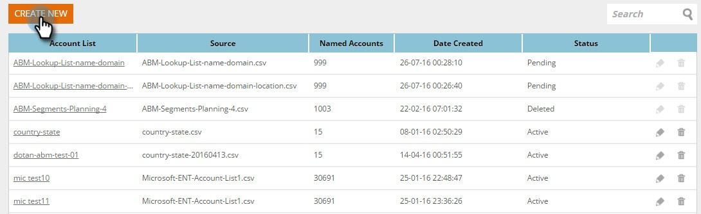

# Crea nuovo elenco account {#create-a-new-account-list}

Crea e carica un elenco di nomi di organizzazione e dominio per questi account chiave con campagne personalizzate.

>[!NOTE]
>
>Questo articolo applica solo ai clienti Web ABM legacy. Se avete acquisito Web ABM dopo settembre 2016, seguite i passaggi descritti in [questo articolo](https://docs.marketo.com/display/DOCS/Account+Lists#AccountLists-CreateaNewAccountList).

## Crea nuovo elenco account {#create-a-new-account-list-1}

1. Vai a **Elenchi account**.

   

1. Selezionare **Crea nuovo**.

   

1. Selezionate **Sfoglia** e caricate il file CSV (accertatevi che il file CSV soddisfi i criteri). Aggiungere un **Nome** e **Descrizione**. Fare clic su **Salva**.

   

   >[!NOTE]
   >
   >**Qual è il formato per il file CSV?**
   >
   >
   >Assicuratevi che il file CSV dell&#39;account denominato soddisfi i seguenti requisiti:
   >
   >* Salvato come formato CSV
   >* Non supera 10 MB
   >* Solo 4 colonne con l’intestazione Colonna A: Nome, colonna B: Dominio, colonna C: Paese, Colonna D: Stato USA.
   >* Il file caricato può richiedere fino a 2 giorni lavorativi prima dell&#39;approvazione.
   >* Riceverai una notifica e-mail di approvazione o controllerai lo stato del file nella pagina Account denominati.
   >* Il numero totale di record/righe accumulati per tutti gli elenchi caricati inizia da 10K, con il pacchetto più grande per un totale di 100K.

   >[!NOTE]
   >
   >**Esempio**
   >
   >**Esempio del file CSV**
   >
   >* Riga 1 Colonna A valore = Organizzazione
   >* Riga 1 Colonna B valore = Dominio
   >* Riga 1 Colonna C valore = Paese
   >* Riga 1 Valore colonna D = Stato USA
   >* Uno dei valori delle colonne è obbligatorio. Tuttavia, fornendo sia i nomi di organizzazione che di dominio si migliorano le percentuali di corrispondenza dell&#39;Elenco account.
   >* Paese e stato sono valori facoltativi.

      >
      >  
   * Per il nome del paese, usate il nome completo del paese o il codice abbreviato. Esempio Stati Uniti o Stati Uniti.
   >  * Per uno stato degli Stati Uniti, utilizzate il codice di abbreviazione di due lettere, ad esempio CA. Solo gli Stati Uniti sono riconosciuti.

   >    
   >

## Modifica di un elenco di account {#edit-an-account-list}

Nella pagina **Elenchi account**, fare clic sull&#39;icona **Edit **nell&#39;elenco.

Selezionate **Sfoglia** e caricate il nuovo file CSV. Questo file sostituirà il file originale. Fare clic su **Salva**. Il nuovo file caricato rimarrà in sospeso fino all’approvazione da parte del supporto di Marketo. Quando in uno stato in sospeso il file originale rimarrà attivo.

Il file CSV sostituirà il file esistente. L&#39;elenco esistente rimarrà attivo fino al completamento dell&#39;elaborazione del nuovo file.

## Eliminare un elenco di account denominato {#delete-a-named-account-list}

1. Nella pagina **Account List **fare clic sull&#39;icona **Delete **dell&#39;elenco che si desidera eliminare.

   

1. Viene visualizzato un messaggio di conferma per l’eliminazione dell’elenco. Fare clic su **OK**.

   

>[!MORELIKETHIS]
>
>* [Creazione di un segmento tramite un elenco di account](create-a-segment-using-an-account-list.md)
>* [Visualizzazione di un elenco di account denominato](https://docs.marketo.com/pages/viewpage.action?pageid=4720244)

