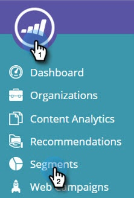

# Creare un segmento utilizzando un elenco account {#create-a-segment-using-an-account-list}

Ecco come creare un segmento utilizzando un elenco account.

>[!PREREQUISITES]
>
>[Creare un nuovo elenco account](/help/marketo/product-docs/target-account-management/target/account-lists.md)

1. Vai a **Segmenti**.

   

1. Fai clic su **Crea nuovo**.

   

1. Inserisci un nome per il segmento. Trascinamento della selezione **Elenchi account** dal **Firmografica** sezione .

   

1. Seleziona un Elenco account dall&#39;elenco degli account denominati caricati. Il numero tra parentesi accanto a Nome elenco account corrisponde all’ID dell’elenco per riferimento API.

   

   >[!NOTE]
   >
   >Gli elenchi degli account vengono sincronizzati da ABM alla personalizzazione web per l’utilizzo in Segmentazione. Selezionali dal menu a discesa. La sincronizzazione può richiedere fino a cinque minuti. Si sincronizza solo se nell&#39;elenco account sono presenti uno o più account denominati.

1. Fai clic su **Salva** o fai clic su **Salva e definisci campagna** per passare alla pagina Campagne .

   

Complimenti. Ora hai impostato un segmento che esegue il targeting di un elenco account.
